# PyTorch Remote Sensing (torchrs)


(WIP) PyTorch implementation of popular datasets and models in remote sensing tasks (Change Detection, Image Super Resolution, Land Cover Classification/Segmentation, Image Captioning, Audio-visual recognition etc.) for various Optical (Sentinel-2, Landsat, etc.) and Synthetic Aperture Radar (SAR) (Sentinel-1) sensors.

## Installation

```bash
# pypi
pip install torch-rs

# pypi with training extras
pip install 'torch-rs[train]'

# latest
pip install git+https://github.com/isaaccorley/torchrs

# latest with extras
pip install 'git+https://github.com/isaaccorley/torchrs.git#egg=torch-rs[train]'
```

## Table of Contents

* [Datasets](https://github.com/isaaccorley/torchrs#datasets)
* [Models](https://github.com/isaaccorley/torchrs#models)
* [Training](https://github.com/isaaccorley/torchrs#training)

## Datasets

* [PROBA-V Multi-Image Super Resolution](https://github.com/isaaccorley/torchrs#proba-v-super-resolution)
* [ETCI 2021 Flood Detection](https://github.com/isaaccorley/torchrs#etci-2021-flood-detection)
* [HKH Glacier Mapping](https://github.com/isaaccorley/torchrs#hkh-glacier-mapping)
* [ZueriCrop - Time-Series Instance Segmentation](https://github.com/isaaccorley/torchrs#zuericrop)
* [FAIR1M - Fine-grained Object Recognition](https://github.com/isaaccorley/torchrs#fair1m---fine-grained-object-recognition)
* [ADVANCE - Audiovisual Aerial Scene Recognition](https://github.com/isaaccorley/torchrs#advance---audiovisual-aerial-scene-recognition)
* [OSCD - Onera Satellite Change Detection](https://github.com/isaaccorley/torchrs#onera-satellite-change-detection-oscd)
* [S2Looking - Satellite Side-Looking Change Detection](https://github.com/isaaccorley/torchrs#satellite-side-looking-s2looking-change-detection)
* [LEVIR-CD+ - LEVIR Change Detection+](https://github.com/isaaccorley/torchrs#levir-change-detection-levir-cd)
* [HRSCD - High Resolution Semantic Change Detection](https://github.com/isaaccorley/torchrs#high-resolution-semantic-change-detection-hrscd)
* [S2MTCP - Sentinel-2 Multitemporal Cities Pairs](https://github.com/isaaccorley/torchrs#sentinel-2-multitemporal-cities-pairs-s2mtcp)
* [RSVQA LR - Remote Sensing Visual Question Answering Low Resolution](https://github.com/isaaccorley/torchrs#remote-sensing-visual-question-answering-rsvqa-low-resolution-lr)
* [RSVQA HR - Remote Sensing Visual Question Answering High Resolution](https://github.com/isaaccorley/torchrs#remote-sensing-visual-question-answering-rsvqa-high-resolution-hr)
* [RSVQAxBEN - Remote Sensing Visual Question Answering BigEarthNet](https://github.com/isaaccorley/torchrs#remote-sensing-visual-question-answering-bigearthnet-rsvqaxben)
* [RSICD - Remote Sensing Image Captioning Dataset](https://github.com/isaaccorley/torchrs#remote-sensing-image-captioning-dataset-rsicd)
* [Sydney Captions](https://github.com/isaaccorley/torchrs#sydney-captions)
* [UC Merced (UCM) Captions](https://github.com/isaaccorley/torchrs#uc-merced-ucm-captions)
* [RESISC45 - Scene Classification](https://github.com/isaaccorley/torchrs#remote-sensing-image-scene-classification-resisc45)
* [EuroSAT - Scene Classification](https://github.com/isaaccorley/torchrs#eurosat)
* [SAT-4-&-SAT-6 - Scene Classification](https://github.com/isaaccorley/torchrs#sat-4--sat-6)
* [AID - Scene Classification](https://github.com/isaaccorley/torchrs#aerial-image-dataset-aid)
* [Inria Aerial Image Labeling - Building Semantic Segmentation](https://github.com/isaaccorley/torchrs#inria-aerial-image-labeling)
* [Dubai - Semantic Segmentation](https://github.com/isaaccorley/torchrs#dubai-segmentation)
* [GID-15 - Semantic Segmentation](https://github.com/isaaccorley/torchrs#gid-15)
* [TiSeLaC - Time-Series Land Cover Classification](https://github.com/isaaccorley/torchrs#tiselac)
* [UC Merced - Land Use Classification](https://github.com/isaaccorley/torchrs#uc-merced-ucm)
* [PatternNet - Image Retrieval / Scene Classification](https://github.com/isaaccorley/torchrs#patternnet)
* [WHU-RS19 - Scene Classification](https://github.com/isaaccorley/torchrs#whu-rs19)
* [RSSCN7 - Scene Classification](https://github.com/isaaccorley/torchrs#rsscn7)
* [Brazilian Coffee Scenes - Scene Classification](https://github.com/isaaccorley/torchrs#brazilian-coffee-scenes)

### PROBA-V Super Resolution

</img>

The [PROBA-V Super Resolution Challenge](https://kelvins.esa.int/proba-v-super-resolution/home/) dataset is a Multi-image Super Resolution (MISR) dataset of images taken by the [ESA PROBA-Vegetation satellite](https://earth.esa.int/eogateway/missions/proba-v). The dataset contains sets of unregistered 300m low resolution (LR) images which can be used to generate single 100m high resolution (HR) images for both Near Infrared (NIR) and Red bands. In addition, Quality Masks (QM) for each LR image and Status Masks (SM) for each HR image are available. The PROBA-V contains sensors which take imagery at 100m and 300m spatial resolutions with 5 and 1 day revisit rates, respectively. Generating high resolution imagery estimates would effectively increase the frequency at which HR imagery is available for vegetation monitoring.

The dataset can be downloaded (0.83GB) using `scripts/download_probav.sh` and instantiated below:

```python
from torchrs.transforms import Compose, ToTensor
from torchrs.datasets import PROBAV

transform = Compose([ToTensor()])

dataset = PROBAV(
    root="path/to/dataset/",
    split="train",  # or 'test'
    band="RED",     # or 'NIR'
    lr_transform=transform,
    hr_transform=transform
)

x = dataset[0]
"""
x: dict(
    lr: low res images  (t, 1, 128, 128)
    qm: quality masks   (t, 1, 128, 128)
    hr: high res image  (1, 384, 384)
    sm: status mask     (1, 384, 384)
)
t varies by set of images (minimum of 9)
"""
```

### ETCI 2021 Flood Detection

</img>

The [ETCI 2021 Dataset](https://nasa-impact.github.io/etci2021/) is a flood detection segmentation dataset of SAR images taken by the [ESA Sentinel-1 satellite](https://sentinel.esa.int/web/sentinel/missions/sentinel-1). The dataset contains pairs of VV and VH polarization images processed by the Hybrid Pluggable Processing Pipeline (hyp3) along with corresponding binary flood and water body ground truth masks.

The dataset can be downloaded (5.6GB) using `scripts/download_etci2021.sh` and instantiated below:

```python
from torchrs.transforms import Compose, ToTensor
from torchrs.datasets import ETCI2021

transform = Compose([ToTensor()])

dataset = ETCI2021(
    root="path/to/dataset/",
    split="train",  # or 'val', 'test'
    transform=transform
)

x = dataset[0]
"""
x: dict(
    vv:         (3, 256, 256)
    vh:         (3, 256, 256)
    flood_mask: (1, 256, 256)
    water_mask: (1, 256, 256)
)
"""
```

### HKH Glacier Mapping

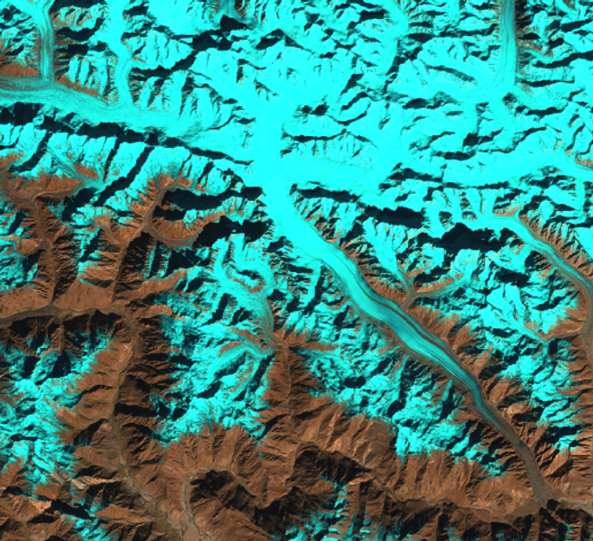</img>

The [Hindu Kush Himalayas (HKH) Glacier Mapping](https://lila.science/datasets/hkh-glacier-mapping) dataset is a semantic segmentation dataset of 7,095 512x512 multispectral images taken by the [USGS LandSat 7 satellite](https://landsat.gsfc.nasa.gov/landsat-7). The dataset contains imagery from 2002-2008 of the HKH region (spanning 8 countries) along with separate masks of clean-iced and debris-covered glaciers. The imagery contains 15 bands which includes 10 LandSat 7 bands, 3 precomputed NVDI/NDSI/NDWI indices, and 2 digital elevation and slope maps from the [SRTM 90m DEM Digital Elevation Database](https://srtm.csi.cgiar.org/).

The dataset can be downloaded (18GB/109GB compressed/uncompressed) using `scripts/download_hkh_glacier.sh` and instantiated below:

```python
from torchrs.transforms import Compose, ToTensor
from torchrs.datasets import HKHGlacierMapping

transform = Compose([ToTensor()])

dataset = HKHGlacierMapping(
    root="path/to/dataset/",
    transform=transform
)

x = dataset[0]
"""
x: dict(
    x:                   (15, 512, 512)
    clean_ice_mask:      (1, 512, 512)
    debris_covered_mask: (1, 256, 256)
)
"""

dataset.bands
"""
['LE7 B1 (blue)', 'LE7 B2 (green)', 'LE7 B3 (red)', 'LE7 B4 (near infrared)', 'LE7 B5 (shortwave infrared 1)',
'LE7 B6_VCID_1 (low-gain thermal infrared)', 'LE7 B6_VCID_2 (high-gain thermal infrared)',
'LE7 B7 (shortwave infrared 2)', 'LE7 B8 (panchromatic)', 'LE7 BQA (quality bitmask)', 'NDVI (vegetation index)',
'NDSI (snow index)', 'NDWI (water index)', 'SRTM 90 elevation', 'SRTM 90 slope']
"""
```

### ZueriCrop

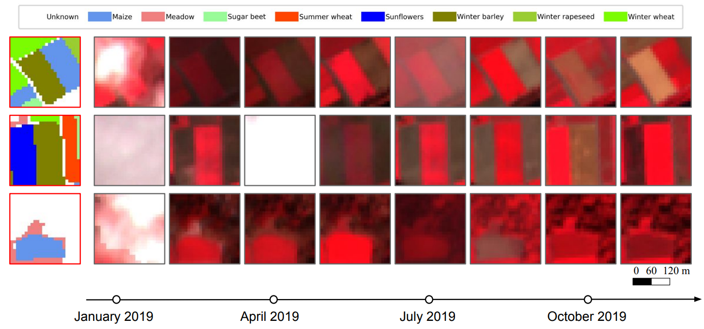</img>

The [ZueriCrop](https://github.com/0zgur0/ms-convSTAR) dataset is a time-series instance segmentation dataset proposed in ["Crop mapping from image time series: deep learning with multi-scale label hierarchies", Turkoglu et al.](https://arxiv.org/abs/2102.08820) of 116k medium resolution (10m) 24x24 multispectral 9-band imagery of Zurich and Thurgau, Switzerland taken by the [ESA Sentinel-2 satellite](https://sentinel.esa.int/web/sentinel/missions/sentinel-2) and contains pixel level semantic and instance annotations for 48 fine-grained, hierarchical categories of crop types. Note that there is only a single ground truth semantic & instance mask per time-series.

The dataset can be downloaded (39GB) using `scripts/download_zuericrop.sh` and instantiated below:

```python
from torchrs.transforms import Compose, ToTensor
from torchrs.datasets import ZueriCrop

transform = Compose([ToTensor()])

dataset = ZueriCrop(
    root="path/to/dataset/",
    transform=transform
)

x = dataset[0]
"""
x: dict(
    x:              (142, 9, 24, 24)    (t, c, h, w)
    mask:           (1, 24, 24)
    instance_mask:  (1, 24, 24)
)
"""

[cls.label for cls in ds.classes]
"""
['Unknown', 'SummerBarley', 'WinterBarley', 'Oat', 'Wheat', 'Grain', ...]
"""
```

### FAIR1M - Fine-grained Object Recognition

</img>

The [FAIR1M](http://gaofen-challenge.com/) dataset, proposed in ["FAIR1M: A Benchmark Dataset for Fine-grained Object Recognition in High-Resolution Remote Sensing Imagery", Sun et al.](https://arxiv.org/abs/2103.05569) is a fine-grained object recognition/detection dataset of 15,000 high resolution (0.3-0.8m) RGB images taken by the [Gaogen (GF)](https://earth.esa.int/web/eoportal/satellite-missions/g/gaofen-1) satellites and extracted from [Google Earth](https://earth.google.com/web/). The dataset contains rotated bounding boxes for objects of 5 categories (ships, vehicles, airplanes, courts, and roads) and 37 sub-categories. This dataset is a part of the [ISPRS Benchmark on Object Detection in High-Resolution Satellite Images](http://gaofen-challenge.com/benchmark). Note that so far only a portion of the training dataset has been released for the challenge (1,732/15,000 images).

The dataset can be downloaded (8.7GB) using `scripts/download_fair1m.sh` and instantiated below:

```python
import torchvision.transforms as T
from torchrs.datasets import FAIR1M

transform = T.Compose([T.ToTensor()])

dataset = FAIR1M(
    root="path/to/dataset/",
    split="train",  # only 'train' for now
    transform=transform,
)

x = dataset[0]
"""
x: dict(
    x: (3, h, w)
    y: (N,)
    points: (N, 5, 2)
)
where N is the number of objects in the image
"""
```

### ADVANCE - Audiovisual Aerial Scene Recognition

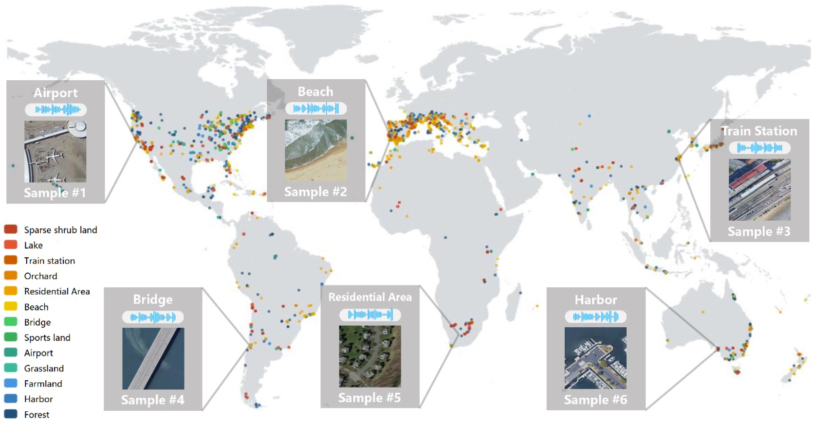</img>

The [AuDio Visual Aerial sceNe reCognition datasEt (ADVANCE)](https://akchen.github.io/ADVANCE-DATASET/) dataset, proposed in ["Cross-Task Transfer for Geotagged Audiovisual Aerial Scene Recognition", Hu et al.](https://arxiv.org/abs/2005.08449) is a dataset composed of 5,075 pairs of geotagged audio recordings and 512x512 RGB images extracted from [FreeSound](https://freesound.org/browse/geotags/?c_lat=24&c_lon=20&z=2) and [Google Earth](https://earth.google.com/web/), respectively. The images are then labeled into 13 scene categories using [OpenStreetMap](https://www.openstreetmap.org/#map=5/38.007/-95.844).

The dataset can be downloaded (4.5GB) using `scripts/download_advance.sh` and instantiated below:

```python
import torchvision.transforms as T
from torchrs.datasets import ADVANCE

image_transform = T.Compose([T.ToTensor()])
audio_transform = T.Compose([])

dataset = ADVANCE(
    root="path/to/dataset/",
    image_transform=image_transform,
    audio_transform=audio_transform,
)

x = dataset[0]
"""
x: dict(
    image: (3, 512, 512)
    audio: (1, 220500)
    cls: int
)
"""

dataset.classes
"""
['airport', 'beach', 'bridge', 'farmland', 'forest', 'grassland', 'harbour', 'lake',
'orchard', 'residential', 'sparse shrub land', 'sports land', 'train station']
"""
```

### Onera Satellite Change Detection (OSCD)

</img>

The [Onera Satellite Change Detection (OSCD)](https://rcdaudt.github.io/oscd/) dataset, proposed in ["Urban Change Detection for Multispectral Earth Observation Using Convolutional Neural Networks", Daudt et al.](https://arxiv.org/abs/1810.08468) is a change detection dataset of multispectral (MS) images taken by the [ESA Sentinel-2 satellite](https://sentinel.esa.int/web/sentinel/missions/sentinel-2). The dataset contains 24 registered image pairs from multiple continents between 2015-2018 along with binary change masks.

The dataset can be downloaded (0.73GB) using `scripts/download_oscd.sh` and instantiated below:

```python
from torchrs.transforms import Compose, ToTensor
from torchrs.datasets import OSCD

transform = Compose([ToTensor(permute_dims=False)])

dataset = OSCD(
    root="path/to/dataset/",
    split="train",  # or 'test'
    transform=transform,
)

x = dataset[0]
"""
x: dict(
    x: (2, 13, h, w)
    mask: (1, h, w)
)
"""
```

### Satellite Side-Looking (S2Looking) Change Detection

</img>

The [S2Looking](https://github.com/AnonymousForACMMM/Dataset) dataset, proposed in ["S2Looking: A Satellite Side-Looking Dataset for Building Change Detection", Shen et al.](https://arxiv.org/abs/2107.09244) is a rural building change detection dataset of 5,000 1024x1024 0.5-0.8m registered RGB image pairs of varying off-nadir angles taken by the [Gaogen (GF)](https://earth.esa.int/web/eoportal/satellite-missions/g/gaofen-1), [SuperView (SV)](https://eos.com/find-satellite/superview-1/), and [BeiJing-2 (BJ-2)](https://space.oscar.wmo.int/satelliteprogrammes/view/beijing_2) satellites. The dataset contains separate new and demolished building masks from regions all over the Earth with a time span of 1-3 years. This dataset was proposed along with the LEVIR-CD+ dataset and is considered difficult due to the rural locations and off-nadir angles.

The dataset can be downloaded (11GB) using `scripts/download_s2looking.sh` and instantiated below:

```python
from torchrs.transforms import Compose, ToTensor
from torchrs.datasets import S2Looking

transform = Compose([ToTensor()])

dataset = S2Looking(
    root="path/to/dataset/",
    split="train",  # or 'val', 'test'
    transform=transform,
)

x = dataset[0]
"""
x: dict(
    x: (2, 3, 1024, 1024)
    build_mask: (1, 1024, 1024),
    demolish_mask: (1, 1024, 1024)
)
"""
```

### LEVIR Change Detection+ (LEVIR-CD+)

</img>

The [LEVIR-CD+](https://github.com/AnonymousForACMMM/Dataset) dataset, proposed in ["S2Looking: A Satellite Side-Looking Dataset for Building Change Detection", Shen et al.](https://arxiv.org/abs/2107.09244) is an urban building change detection dataset of 985 1024x1024 0.5m RGB image pairs extracted from Google Earth. The dataset contains building/land use change masks from 20 different regions of Texas between 2002-2020 with a time span of 5 years. This dataset was proposed along with the S2Looking dataset and is considered the easier version due to the urban locations and near-nadir angles.

The dataset can be downloaded (3.6GB) using `scripts/download_levircd_plus.sh` and instantiated below:

```python
from torchrs.transforms import Compose, ToTensor
from torchrs.datasets import LEVIRCDPlus

transform = Compose([ToTensor()])

dataset = LEVIRCDPlus(
    root="path/to/dataset/",
    split="train",  # or 'test'
    transform=transform,
)

x = dataset[0]
"""
x: dict(
    x: (2, 3, 1024, 1024)
    mask: (1, 1024, 1024)
)
"""
```

### High Resolution Semantic Change Detection (HRSCD)

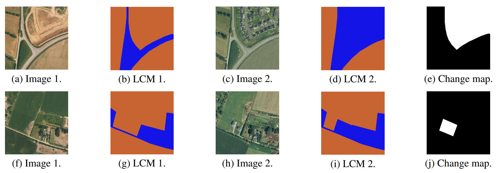</img>

The [High Resolution Semantic Change Detection (HRSCD)](https://ieee-dataport.org/open-access/hrscd-high-resolution-semantic-change-detection-dataset) dataset, proposed in ["Multitask Learning for Large-scale Semantic Change Detection", Daudt et al.](https://arxiv.org/abs/1810.08452) is a change detection dataset of high resolution (0.5m) aerial RGB image pairs extracted from the [French National Institute of Geographical and Forest Information (IGN) database](https://geoservices.ign.fr/documentation/diffusion/telechargement-donnees-libres.html#bd-ortho-50-cm). The dataset contains 291 coregistered image pairs from 2006 and 2012 along with binary change masks extracted from the [Urban Atlas Change 2006-2012 maps](https://land.copernicus.eu/local/urban-atlas/change-2006-2009) and corresponding land cover masks for each image extracted from the [Urban Atlas 2006](https://land.copernicus.eu/local/urban-atlas/urban-atlas-2006) and [Urban Atlas 2012](https://land.copernicus.eu/local/urban-atlas/urban-atlas-2012).

The dataset can be downloaded (12GB) using `scripts/download_hrscd.sh` and instantiated below:

```python
from torchrs.transforms import Compose, ToTensor
from torchrs.datasets import HRSCD

transform = Compose([ToTensor()])

dataset = HRSCD(
    root="path/to/dataset/",
    transform=transform,
)

x = dataset[0]
"""
x: dict(
    x: (2, 3, 1000, 1000)
    lc: (2, 1000, 1000)
    mask: (1, 1000, 1000)
)
"""
```

### Sentinel-2 Multitemporal Cities Pairs (S2MTCP)

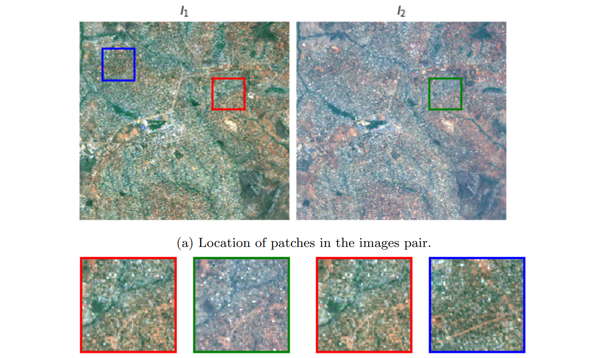</img>

The [Sentinel-2 Multitemporal Cities Pairs (S2MTCP)](https://zenodo.org/record/4280482) dataset, proposed in ["Self-supervised pre-training enhances change detection in Sentinel-2 imagery", Leenstra et al.](https://arxiv.org/abs/2101.08122) is an urban change detection dataset of 1,520 medium resolution 10m unregistered image pairs taken by the [ESA Sentinel-2 satellite](https://sentinel.esa.int/web/sentinel/missions/sentinel-2). The dataset does not contain change masks and was originally used for self-supervised pretraining for other downstream change detection tasks (e.g. the [OSCD](https://github.com/isaaccorley/torchrs#onera-satellite-change-detection-oscd) dataset). The imagery are roughly 600x600 in shape and contain all Sentinel-2 bands of the [Level 1C (L1C) product](https://sentinel.esa.int/web/sentinel/technical-guides/sentinel-2-msi/level-1c/product-formatting) resampled to 10m.

The dataset can be downloaded (10GB/139GB compressed/uncompressed) using `scripts/download_s2mtcp.sh` and instantiated below:

```python
from torchrs.transforms import Compose, ToTensor
from torchrs.datasets import S2MTCP

transform = Compose([ToTensor()])

dataset = S2MTCP(
    root="path/to/dataset/",
    transform=transform,
)

x = dataset[0]  # (2, 14, h, w)
```

### Remote Sensing Visual Question Answering (RSVQA) Low Resolution (LR)

</img>

The [RSVQA LR](https://rsvqa.sylvainlobry.com/) dataset, proposed in ["RSVQA: Visual Question Answering for Remote Sensing Data", Lobry et al.](https://arxiv.org/abs/2003.07333) is a visual question answering (VQA) dataset of 772 256x256 low resolution (10m) RGB images taken by the [ESA Sentinel-2 satellite](https://sentinel.esa.int/web/sentinel/missions/sentinel-2). Each image is annotated with a set of questions and their corresponding answers. Among other applications, this dataset can be used to train VQA models to perform detailed scene understanding of medium resolution remote sensing imagery.

The dataset can be downloaded (0.2GB) using `scripts/download_rsvqa_lr.sh` and instantiated below:

```python
import torchvision.transforms as T
from torchrs.datasets import RSVQALR

transform = T.Compose([T.ToTensor()])

dataset = RSVQALR(
    root="path/to/dataset/",
    split="train",  # or 'val', 'test'
    transform=transform
)

x = dataset[0]
"""
x: dict(
    x:         (3, 256, 256)
    questions:  List[str]
    answers:    List[str]
    types:      List[str]
)
"""
```

### Remote Sensing Visual Question Answering (RSVQA) High Resolution (HR)

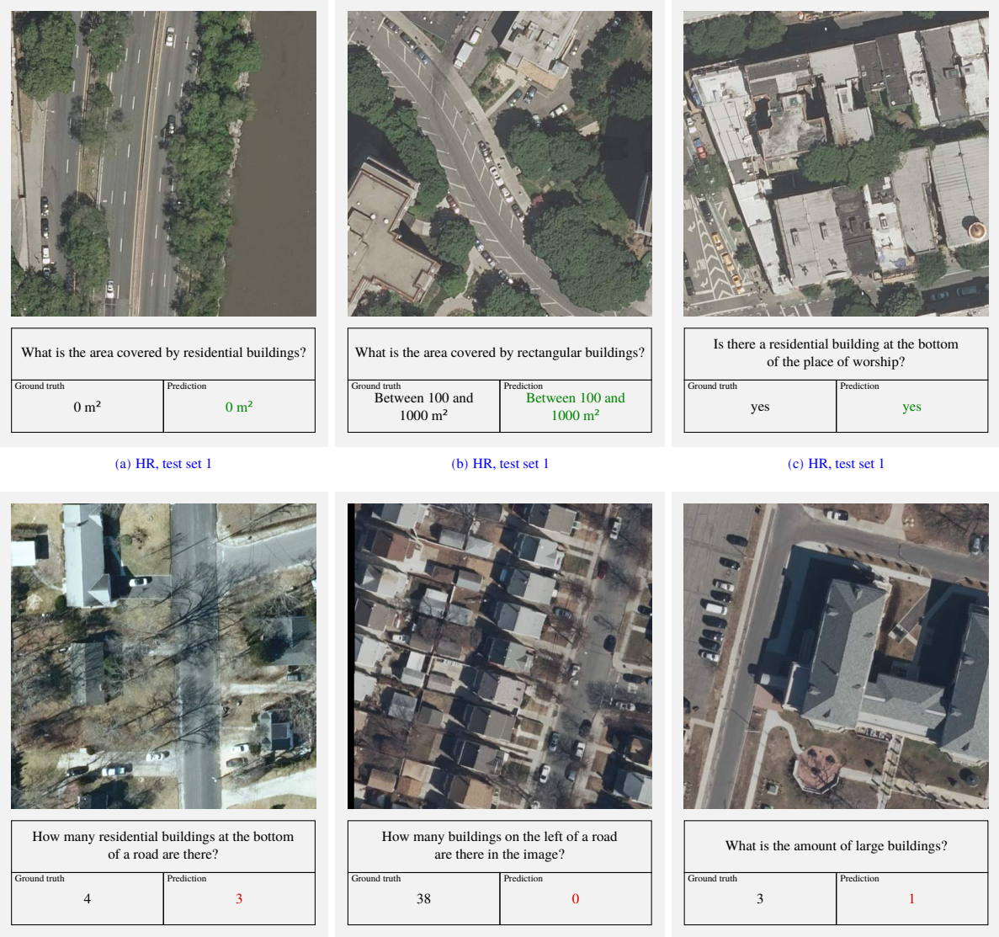</img>

The [RSVQA HR](https://rsvqa.sylvainlobry.com/) dataset, proposed in ["RSVQA: Visual Question Answering for Remote Sensing Data", Lobry et al.](https://arxiv.org/abs/2003.07333) is a visual question answering (VQA) dataset of 772 512x512 high resolution (15cm) aerial RGB images extracted from the [USGS High Resolution Orthoimagery (HRO) collection](https://www.usgs.gov/centers/eros/science/usgs-eros-archive-aerial-photography-high-resolution-orthoimagery-hro?qt-science_center_objects=0#qt-science_center_objects). Each image is annotated with a set of questions and their corresponding answers. Among other applications, this dataset can be used to train VQA models to perform detailed scene understanding of high resolution remote sensing imagery.

The dataset can be downloaded (15GB) using `scripts/download_rsvqa_hr.sh` and instantiated below:

```python
import torchvision.transforms as T
from torchrs.datasets import RSVQALR

transform = T.Compose([T.ToTensor()])

dataset = RSVQALR(
    root="path/to/dataset/",
    split="train",  # or 'val', 'test'
    transform=transform
)

x = dataset[0]
"""
x: dict(
    x:         (3, 256, 256)
    questions:  List[str]
    answers:    List[str]
    types:      List[str]
)
"""
```

### Remote Sensing Visual Question Answering BigEarthNet (RSVQAxBEN)

</img>

The [RSVQAxBEN](https://rsvqa.sylvainlobry.com/) dataset, proposed in ["RSVQA Meets BigEarthNet: A New, Large-Scale, Visual Question Answering Dataset for Remote Sensing", Lobry et al.](https://rsvqa.sylvainlobry.com/IGARSS21.pdf) is a version of the [BigEarthNet](http://bigearth.net/) dataset with visual question answering (VQA) annotations using the same method applied to generate annotations forthe [RSVQA LR](https://github.com/isaaccorley/torchrs#remote-sensing-visual-question-answering-rsvqa-low-resolution-lr) dataset. The dataset consists of 120x120 RGB Sentinel-2 imagery annotated with a set of questions and their corresponding answers.

The dataset can be downloaded (35.4GB) using `scripts/download_rsvqaxben.sh` and instantiated below:

```python
import torchvision.transforms as T
from torchrs.datasets import RSVQAxBEN

transform = T.Compose([T.ToTensor()])

dataset = RSVQAxBEN(
    root="path/to/dataset/",
    split="train",  # or 'val', 'test'
    transform=transform
)

x = dataset[0]
"""
x: dict(
    x:         (3, 120, 120)
    questions:  List[str]
    answers:    List[str]
    types:      List[str]
)
"""
```

### Remote Sensing Image Captioning Dataset (RSICD)

</img>

The [RSICD](https://github.com/201528014227051/RSICD_optimal) dataset, proposed in ["Exploring Models and Data for Remote Sensing Image Caption Generation", Lu et al.](https://arxiv.org/abs/1712.07835) is an image captioning dataset with 5 captions per image for 10,921 224x224 RGB images extracted using [Google Earth](https://earth.google.com/web/), [Baidu Map](https://map.baidu.com/), [MapABC](https://www.mapabc.com/) and [Tianditu](https://www.tianditu.gov.cn/). While one of the larger remote sensing image captioning datasets, this dataset contains very repetitive language with little detail and many captions are duplicated.

The dataset can be downloaded (0.57GB) using `scripts/download_rsicd.sh` and instantiated below:

```python
import torchvision.transforms as T
from torchrs.datasets import RSICD

transform = T.Compose([T.ToTensor()])

dataset = RSICD(
    root="path/to/dataset/",
    split="train",  # or 'val', 'test'
    transform=transform
)

x = dataset[0]
"""
x: dict(
    x:        (3, 224, 224)
    captions: List[str]
)
"""
```

### Sydney Captions

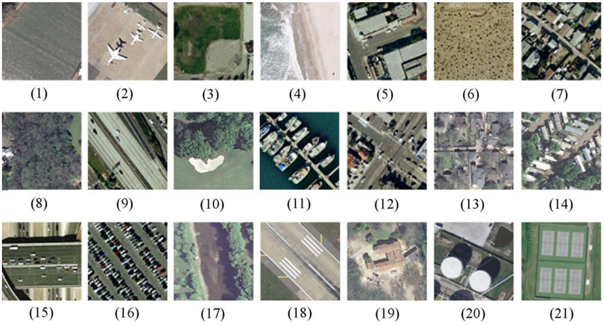</img>

The [Sydney Captions](https://github.com/201528014227051/RSICD_optimal) dataset, proposed in ["Deep semantic understanding of high resolution remote sensing image", Qu et al.](https://ieeexplore.ieee.org/document/7546397) is a version of the Sydney scene classification dataset proposed in ["Saliency-Guided Unsupervised Feature Learning for Scene Classification", Zhang et al](https://ieeexplore.ieee.org/document/6910306). The dataset contains 613 500x500 1ft resolution RGB images of Sydney, Australia extracted using [Google Earth](https://earth.google.com/web/) and is annotated with 5 captions per image.

The dataset can be downloaded (0.44GB) using `scripts/download_sydney_captions.sh` and instantiated below:

```python
import torchvision.transforms as T
from torchrs.datasets import SydneyCaptions

transform = T.Compose([T.ToTensor()])

dataset = SydneyCaptions(
    root="path/to/dataset/",
    split="train",  # or 'val', 'test'
    transform=transform
)

x = dataset[0]
"""
x: dict(
    x:        (3, 500, 500)
    captions: List[str]
)
"""
```

### UC Merced (UCM) Captions

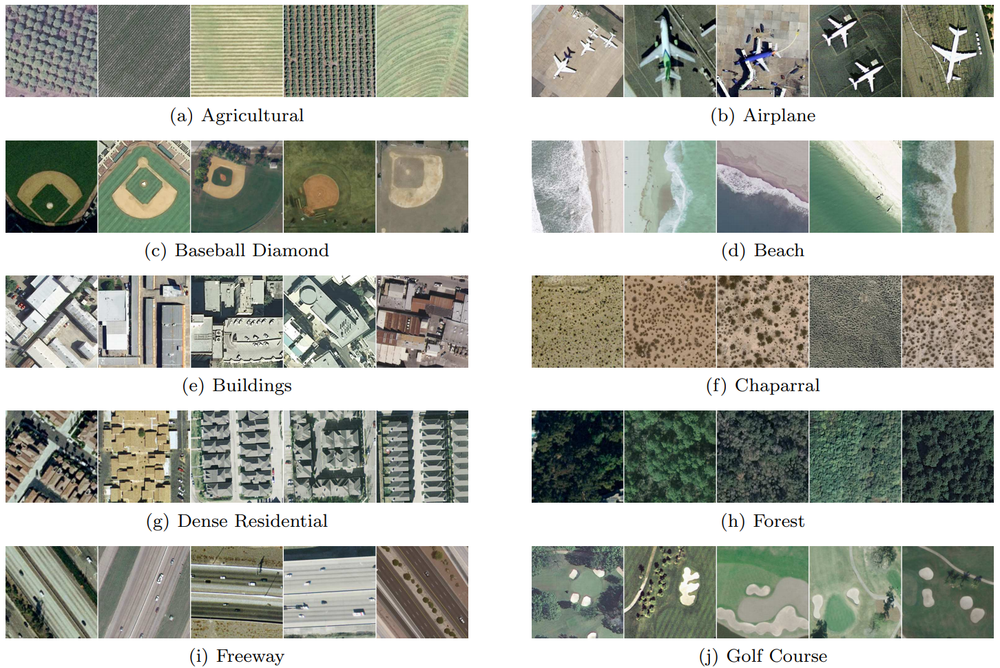</img>

The [UC Merced (UCM) Captions](https://github.com/201528014227051/RSICD_optimal) dataset, proposed in ["Deep semantic understanding of high resolution remote sensing image", Qu et al.](https://ieeexplore.ieee.org/document/7546397) is a version of the [UCM land use classification dataset](http://weegee.vision.ucmerced.edu/datasets/landuse.html) proposed in ["Bag-Of-Visual-Words and Spatial Extensions for Land-Use Classification", Yang et al](https://faculty.ucmerced.edu/snewsam/papers/Yang_ACMGIS10_BagOfVisualWords.pdf). The dataset contains 2100 256x256 1ft resolution RGB images of urban locations around the U.S. extracted from the [USGS National Map Urban Area Imagery collection](https://www.usgs.gov/core-science-systems/national-geospatial-program/national-map) and is annotated with 5 captions per image.

The dataset can be downloaded (0.4GB) using `scripts/download_ucm_captions.sh` and instantiated below:

```python
import torchvision.transforms as T
from torchrs.datasets import UCMCaptions

transform = T.Compose([T.ToTensor()])

dataset = UCMCaptions(
    root="path/to/dataset/",
    split="train",  # or 'val', 'test'
    transform=transform
)

x = dataset[0]
"""
x: dict(
    x:        (3, 256, 256)
    captions: List[str]
)
"""
```

### Remote Sensing Image Scene Classification (RESISC45)

</img>

The [RESISC45](http://www.escience.cn/people/JunweiHan/NWPU-RESISC45.html) dataset, proposed in ["Remote Sensing Image Scene Classification: Benchmark and State of the Art", Cheng et al.](https://arxiv.org/abs/1703.00121) is a scene classification dataset of 31,500 RGB images extracted using [Google Earth](https://earth.google.com/web/). The dataset contains 45 scenes with 700 images per class from over 100 countries and was selected to optimize for high variability in image conditions (spatial resolution, occlusion, weather, illumination, etc.).

The dataset can be downloaded (0.47GB) using `scripts/download_resisc45.sh` and instantiated below:

```python
import torchvision.transforms as T
from torchrs.datasets import RESISC45

transform = T.Compose([T.ToTensor()])

dataset = RESISC45(
    root="path/to/dataset/",
    transform=transform
)

x, y = dataset[0]
"""
x: (3, 256, 256)
y: int
"""

dataset.classes
"""
['airplane', 'airport', 'baseball_diamond', 'basketball_court', 'beach', 'bridge', 'chaparral',
'church', 'circular_farmland', 'cloud', 'commercial_area', 'dense_residential', 'desert', 'forest',
'freeway', 'golf_course', 'ground_track_field', 'harbor', 'industrial_area', 'intersection', 'island',
'lake', 'meadow', 'medium_residential', 'mobile_home_park', 'mountain', 'overpass', 'palace', 'parking_lot',
'railway', 'railway_station', 'rectangular_farmland', 'river', 'roundabout', 'runway', 'sea_ice', 'ship',
'snowberg', 'sparse_residential', 'stadium', 'storage_tank', 'tennis_court', 'terrace', 'thermal_power_station', 'wetland']
"""
```

### EuroSAT

</img>

The [EuroSAT](https://github.com/phelber/eurosat) dataset, proposed in ["EuroSAT: A Novel Dataset and Deep Learning Benchmark for Land Use and Land Cover Classification", Helber et al.](https://arxiv.org/abs/1709.00029) is a land cover classification dataset of 27,000 64x64 images taken by the [ESA Sentinel-2 satellite](https://sentinel.esa.int/web/sentinel/missions/sentinel-2). The dataset contains 10 land cover classes with 2-3k images per class from over 34 European countries. The dataset is available in the form of RGB only or all 13 [Multispectral (MS) Sentinel-2 bands](https://sentinels.copernicus.eu/web/sentinel/user-guides/sentinel-2-msi/resolutions/spatial). This dataset is fairly easy with ~98.6% accuracy achievable with a ResNet-50.

The dataset can be downloaded (.13GB and 2.8GB) using `scripts/download_eurosat_rgb.sh` or `scripts/download_eurosat_ms.sh` and instantiated below:

```python
import torchvision.transforms as T
from torchrs.transforms import ToTensor
from torchrs.datasets import EuroSATRGB, EuroSATMS

transform = T.Compose([T.ToTensor()])

dataset = EuroSATRGB(
    root="path/to/dataset/",
    transform=transform
)

x, y = dataset[0]
"""
x: (3, 64, 64)
y: int
"""

transform = T.Compose([ToTensor()])

dataset = EuroSATMS(
    root="path/to/dataset/",
    transform=transform
)

x, y = dataset[0]
"""
x: (13, 64, 64)
y: int
"""

dataset.classes
"""
['AnnualCrop', 'Forest', 'HerbaceousVegetation', 'Highway', 'Industrial',
'Pasture', 'PermanentCrop', 'Residential', 'River', 'SeaLake']
"""
```

### SAT-4 & SAT-6

</img>

The [SAT-4 & SAT-6](https://csc.lsu.edu/~saikat/deepsat/) datasets, proposed in ["DeepSat - A Learning framework for Satellite Imagery", Basu et al.](https://arxiv.org/abs/1509.03602) are land cover classification datasets of 500k and 405k 28x28 RGBN images, respectively, sampled across the Continental United States (CONUS) and extracted from the [National Agriculture Imagery Program (NAIP)](https://www.fsa.usda.gov/programs-and-services/aerial-photography/imagery-programs/naip-imagery/). The SAT-4 and SAT-6 datasets contain 4 and 6 land cover classes, respectively. This dataset is fairly easy with ~80% accuracy achievable with a 5-layer CNN.

The dataset can be downloaded (2.7GB) using `scripts/download_sat.sh` and instantiated below:

```python
import torchvision.transforms as T
from torchrs.datasets import SAT4, SAT6

transform = T.Compose([T.ToTensor()])

dataset = SAT4(
    root="path/to/dataset/",
    split="train"   # or 'test'
    transform=transform
)

x, y = dataset[0]
"""
x: (4, 28, 28)
y: int
"""

dataset.classes
"""
['barren land', 'trees', 'grassland', 'other']
"""

dataset = SAT6(
    root="path/to/dataset/",
    split="train"   # or 'test'
    transform=transform
)

x, y = dataset[0]
"""
x: (4, 28, 28)
y: int
"""

dataset.classes
"""
['barren land', 'trees', 'grassland', 'roads', 'buildings', 'water']
"""
```

### Aerial Image Dataset (AID)

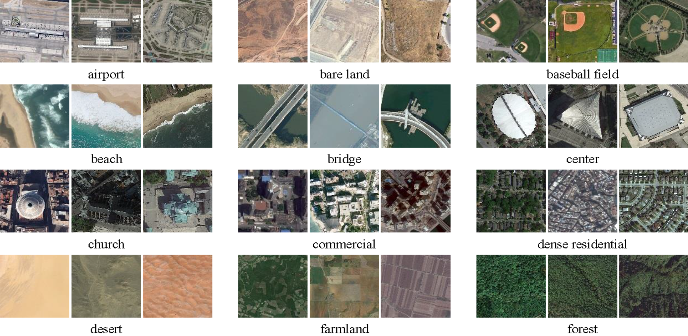</img>

The [AID](https://captain-whu.github.io/AID/) dataset, proposed in ["AID: A Benchmark Dataset for Performance Evaluation of Aerial Scene Classification", Xia et al.](https://arxiv.org/abs/1608.05167) is a scene classification dataset of 10k 600x600 RGB images extracted using [Google Earth](https://earth.google.com/web/). The dataset contains 30 scenes with several hundred images per class from regions and countries around the world. This dataset is fairly easy with ~90% accuracy achievable with a VGG-16.

The dataset can be downloaded (2.6GB) using `scripts/download_aid.sh` and instantiated below:

```python
import torchvision.transforms as T
from torchrs.datasets import AID

transform = T.Compose([T.ToTensor()])

dataset = AID(
    root="path/to/dataset/",
    transform=transform
)

x, y = dataset[0]
"""
x: (3, 600, 600)
y: int
"""

dataset.classes
"""
['Airport', 'BareLand', 'BaseballField', 'Beach', 'Bridge', 'Center', 'Church', 'Commercial',
'DenseResidential', 'Desert', 'Farmland', 'Forest', 'Industrial', 'Meadow', 'MediumResidential',
'Mountain', 'Park', 'Parking', 'Playground', 'Pond', 'Port', 'RailwayStation', 'Resort',
'River', 'School', 'SparseResidential', 'Square', 'Stadium', 'StorageTanks', 'Viaduct']
"""
```

### Inria Aerial Image Labeling

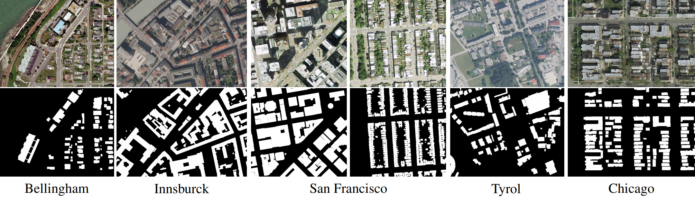</img>

The [Inria Aerial Image Labeling Dataset](https://project.inria.fr/aerialimagelabeling/) is a building semantic segmentation dataset proposed in ["Can semantic labeling methods generalize to any city? the inria aerial image labeling benchmark", Maggiori et al.](https://ieeexplore.ieee.org/document/8127684) of 360 high resolution (0.3m) 5000x5000 RGB imagery extracted from various international GIS services (e.g. [USGS National Map](https://www.usgs.gov/core-science-systems/national-geospatial-program/national-map)). The dataset contains imagery from 10 regions around the world (both urban and rural) with train/test sets split into different cities for the purpose of evaluating if models can generalize across dramatically different locations. The dataset was originally used in the [Inria Aerial Image Labeling Dataset Contest](https://project.inria.fr/aerialimagelabeling/contest/) and the test set ground truth masks have not been released publicly.

The dataset can be downloaded (26GB) using `scripts/download_inria_ail.sh` and instantiated below:

```python
from torchrs.transforms import Compose, ToTensor
from torchrs.datasets import InriaAIL

transform = Compose([ToTensor()])

dataset = InriaAIL(
    root="path/to/dataset/",
    split="train",  # or 'test'
    transform=transform
)

x = dataset[0]
"""
x: dict(
    x:         (3, 5000, 5000)
    mask:      (1, 5000, 5000)
    region:     str
)
"""

dataset.regions
"""
['austin', 'chicago', 'kitsap', 'tyrol', 'vienna']
"""
```

### Dubai Segmentation

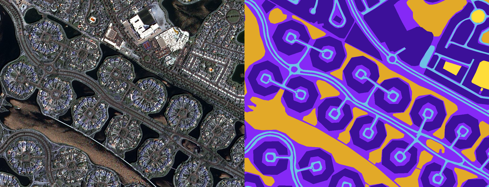</img>

The [Dubai Segmentation](https://humansintheloop.org/resources/datasets/semantic-segmentation-dataset/) dataset is a semantic segmentation dataset of 72 high resolution ~700x700 RGB imagery taken by the [MBRSC satellites](https://www.mbrsc.ae/satellite-programme/services/satellite-imagery). The dataset contains imagery from 9 regions across Dubai and contains masks with 6 categories.

The dataset can be downloaded (0.03GB) using `scripts/download_dubai_segmentation.sh` and instantiated below:

```python
from torchrs.transforms import Compose, ToTensor
from torchrs.datasets import DubaiSegmentation

transform = Compose([ToTensor()])

dataset = DubaiSegmentation(
    root="path/to/dataset/",
    transform=transform
)

x = dataset[0]
"""
x: dict(
    x:         (3, h, w)
    mask:      (1, h, w)
    region:    str
)
"""

dataset.classes.keys()
"""
['Unlabeled', 'Water', 'Land (unpaved area)', 'Road', 'Building', 'Vegetation']
"""
```

### GID-15

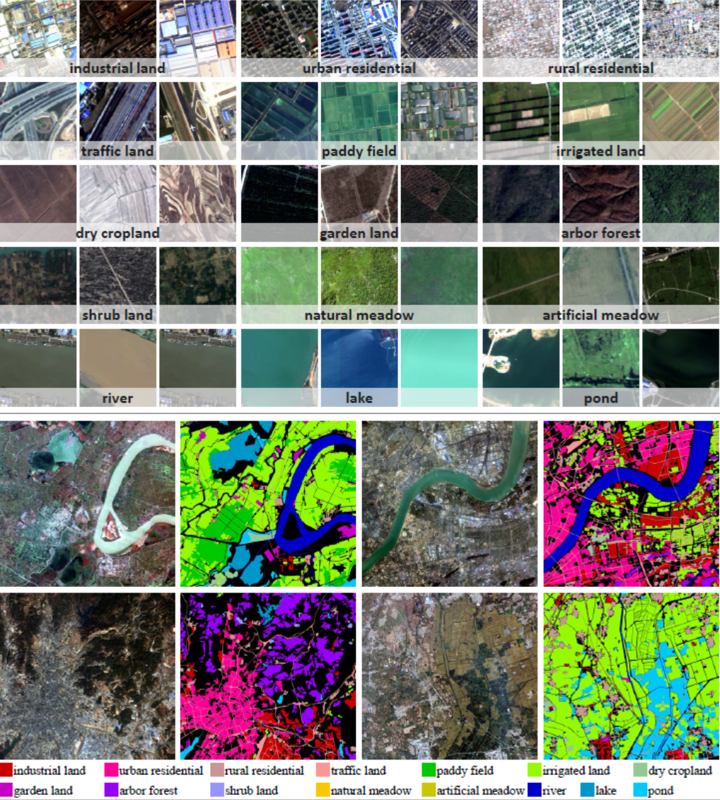</img>

The [Gaofen Image Dataset (GID-15)](https://captain-whu.github.io/GID15/) is a semantic segmentation dataset proposed in ["Land-Cover Classification with High-Resolution Remote Sensing Images Using Transferable Deep Models", Tong et al.](https://arxiv.org/abs/1807.05713) of 150 high resolution (3m) 6800x7200 RGB imagery taken by the [Gaofen-2 satellite](https://directory.eoportal.org/web/eoportal/satellite-missions/g/gaofen-2) and contains pixel level annotations for 15 categories. The dataset was used in a challenge hosted by the [IEEE ICCV 2021 1st Workshop on Learning to Understand Aerial Images](https://captain-whu.github.io/LUAI2021/index.html) and the test set ground truth masks have not been released publicly.

The dataset can be downloaded (36GB) using `scripts/download_gid15.sh` and instantiated below:

```python
from torchrs.transforms import Compose, ToTensor
from torchrs.datasets import GID15

transform = Compose([ToTensor()])

dataset = GID15(
    root="path/to/dataset/",
    split="train",  # or 'val', 'test'
    transform=transform
)

x = dataset[0]
"""
x: dict(
    x:         (3, 6800, 7200)
    mask:      (1, 6800, 7200)
)
"""

dataset.classes
"""
['background', 'industrial_land', 'urban_residential', 'rural_residential', 'traffic_land', 'paddy_field',
'irrigated_land', 'dry_cropland', 'garden_plot', 'arbor_woodland', 'shrub_land', 'natural_grassland',
'artificial_grassland', 'river', 'lake', 'pond']
"""
```

### TiSeLaC

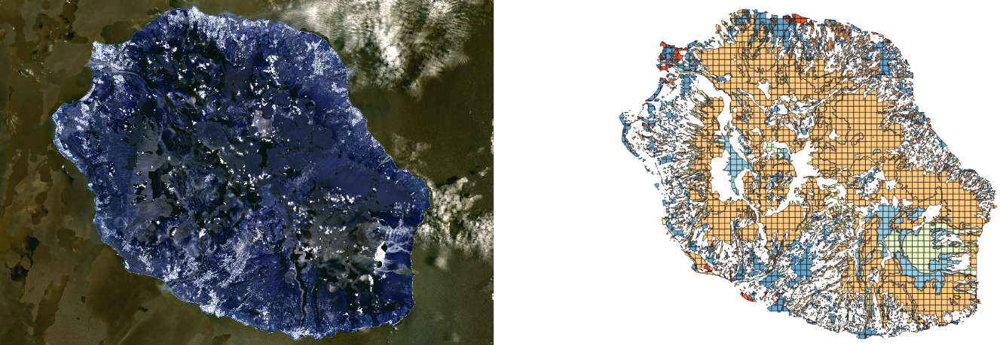</img>

The TiSeLaC dataset from the [Time Series Land Cover Classification Challenge](https://sites.google.com/site/dinoienco/tiselac-time-series-land-cover-classification-challenge) is a time series land cover classification dataset consisting of 23 2866x2633 medium resolution (30m) multispectral 10 band (7 reflectance + NDVI/NDWI/Brightness Index) images taken by the [USGS Landsat 8 satellite](https://www.usgs.gov/core-science-systems/nli/landsat/landsat-8). The imagery was captured over Reunion Island in 2014 and contains 9 land cover classes derived from the [Corine Land Cover (CLC) map](https://land.copernicus.eu/pan-european/corine-land-cover). Note that the dataset is formatted for pixelwise time-series classification where each time series is of the form `(t, b)` where `t=23 samples` and `b=10 bands`. This dataset is very easy with the top score currently standing at `0.9929` F1 Score.

The dataset can be downloaded (0.08GB) using `scripts/download_tiselac.sh` and instantiated below:

```python
from torchrs.transforms import Compose, ToTensor
from torchrs.datasets import Tiselac

transform = Compose([ToTensor()])

dataset = Tiselac(
    root="path/to/dataset/",
    split="train"   # or 'test'
    transform=transform
)

x, y = dataset[0]
"""
x: (23, 10)
y: int
"""

dataset.classes
"""
['Urban Areas', 'Other built-up surfaces', 'Forests', 'Sparse Vegetation', 'Rocks and bare soil',
'Grassland', 'Sugarcane crops', 'Other crops', 'Water']
"""
```

### UC Merced (UCM)

</img>

The [UC Merced (UCM)](http://weegee.vision.ucmerced.edu/datasets/landuse.html) dataset, proposed in ["Bag-Of-Visual-Words and Spatial Extensions for Land-Use Classification", Yang et al.](https://faculty.ucmerced.edu/snewsam/papers/Yang_ACMGIS10_BagOfVisualWords.pdf) is a land use classification dataset of 21k 256x256 1ft resolution RGB images of urban locations around the U.S. extracted from the [USGS National Map Urban Area Imagery collection](https://www.usgs.gov/core-science-systems/national-geospatial-program/national-map) with 21 land use classes (100 images per class).

The dataset can be downloaded (0.42GB) using `scripts/download_ucm.sh` and instantiated below:

```python
import torchvision.transforms as T
from torchrs.datasets import UCM

transform = T.Compose([T.ToTensor()])

dataset = UCM(
    root="path/to/dataset/",
    transform=transform
)

x, y = dataset[0]
"""
x: (3, 256, 256)
y: int
"""

dataset.classes
"""
['agricultural', 'airplane', 'baseballdiamond', 'beach', 'buildings', 'chaparral', 'denseresidential',
'forest', 'freeway', 'golfcourse', 'harbor', 'intersection', 'mediumresidential', 'mobilehomepark',
'overpass', 'parkinglot', 'river', 'runway', 'sparseresidential', 'storagetanks', 'tenniscourt']
"""
```

### PatternNet

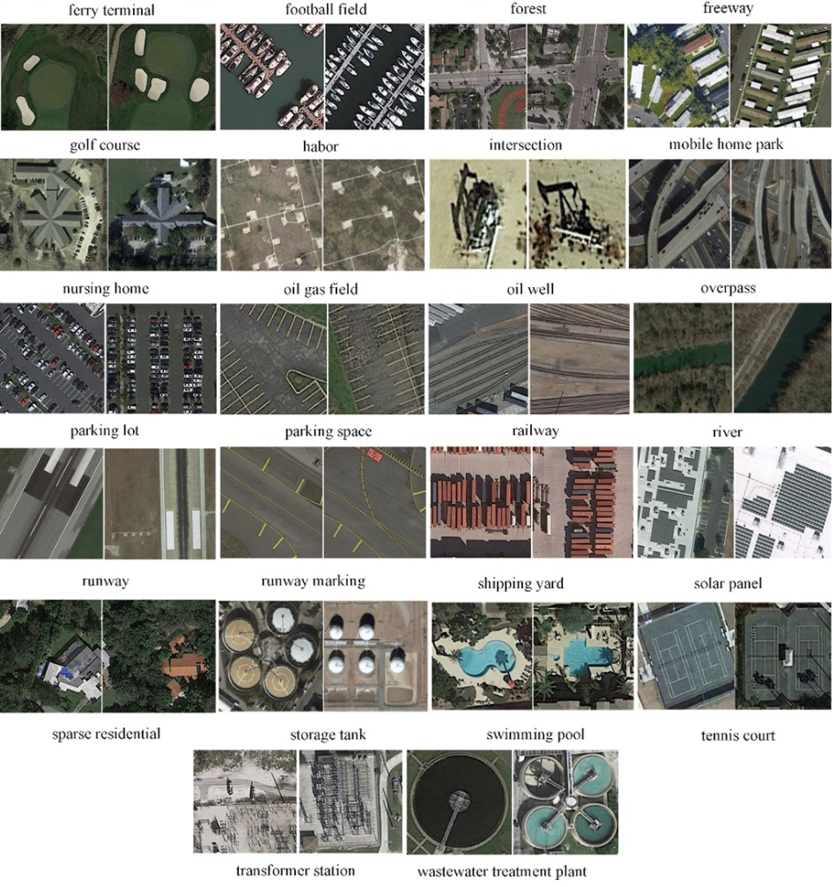</img>

The [PatternNet](https://sites.google.com/view/zhouwx/dataset) dataset, proposed in ["PatternNet: A Benchmark Dataset for Performance Evaluation of Remote Sensing Image Retrieval", Yang et al.](https://arxiv.org/abs/1706.03424) is a image retrieval and scene classification dataset of 30,400 256x256 high resolution (.06-5m) RGB images extracted using [Google Earth](https://earth.google.com/web/) and [Google Maps](https://developers.google.com/maps) with 38 scene classes (800 images per class). This dataset was originally proposed as a remote sensing image retrieval (RSIR) dataset with classes selected for high intra-class diversity and inter-class similarity such that image retrieval requires learning fine-grained details between multiple classes. Additionally, this dataset has some unique classes not found in other scene classification datasets, e.g. oil well, nursing home, solar panel, etc.

The dataset can be downloaded (1.4GB) using `scripts/download_patternnet.sh` and instantiated below:

```python
import torchvision.transforms as T
from torchrs.datasets import PatternNet

transform = T.Compose([T.ToTensor()])

dataset = PatternNet(
    root="path/to/dataset/",
    transform=transform
)

x, y = dataset[0]
"""
x: (3, 256, 256)
y: int
"""

dataset.classes
"""
['airplane', 'baseball_field', 'basketball_court', 'beach', 'bridge', 'cemetery', 'chaparral',
'christmas_tree_farm', 'closed_road', 'coastal_mansion', 'crosswalk', 'dense_residential',
'ferry_terminal', 'football_field', 'forest', 'freeway', 'golf_course', 'harbor', 'intersection',
'mobile_home_park', 'nursing_home', 'oil_gas_field', 'oil_well', 'overpass', 'parking_lot', 'parking_space',
'railway', 'river', 'runway', 'runway_marking', 'shipping_yard', 'solar_panel','sparse_residential',
'storage_tank', 'swimming_pool', 'tennis_court', 'transformer_station', 'wastewater_treatment_plant']
"""
```

### WHU-RS19

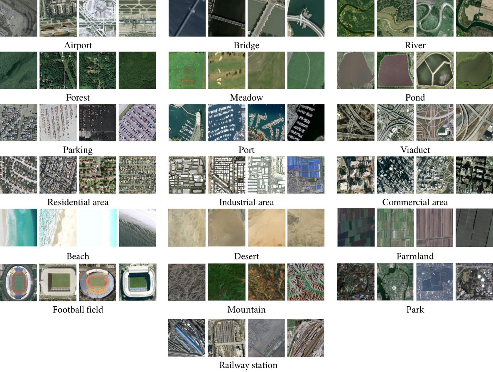</img>

The [WHU-RS19](https://captain-whu.github.io/BED4RS/#) dataset, proposed in ["Structural High-resolution Satellite Image Indexing", Xia et al.](https://hal.archives-ouvertes.fr/file/index/docid/458685/filename/structural_satellite_indexing_XYDG.pdf) is a scene classification dataset of 1,005 600x600 high resolution (up to 0.5m) RGB images extracted using [Google Earth](https://earth.google.com/web/) with 19 scene classes (~50 images per class).

The dataset can be downloaded (0.11GB) using `scripts/download_whu_rs19.sh` and instantiated below:

```python
import torchvision.transforms as T
from torchrs.datasets import WHURS19

transform = T.Compose([T.ToTensor()])

dataset = WHURS19(
    root="path/to/dataset/",
    transform=transform
)

x, y = dataset[0]
"""
x: (3, 600, 600)
y: int
"""

dataset.classes
"""
['Airport', 'Beach', 'Bridge', 'Commercial', 'Desert', 'Farmland','Forest', 'Industrial',
'Meadow', 'Mountain', 'Park', 'Parking', 'Pond', 'Port', 'Residential', 'River', 'Viaduct',
'footballField', 'railwayStation']
"""
```

### RSSCN7

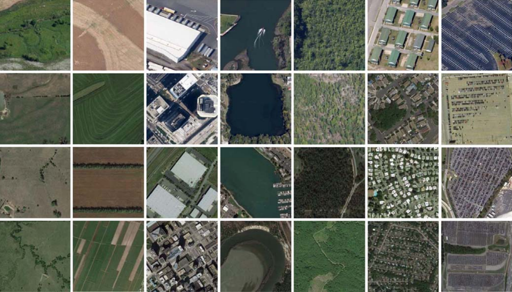</img>

The [RSSCN7](https://github.com/palewithout/RSSCN7) dataset, proposed in ["Deep Learning Based Feature Selection for Remote Sensing Scene Classification", Zou et al.](https://ieeexplore.ieee.org/abstract/document/7272047) is a scene classification dataset of 2,800 400x400 high resolution RGB images extracted using [Google Earth](https://earth.google.com/web/) with 7 scene classes (400 images per class).

The dataset can be downloaded (0.36GB) using `scripts/download_rsscn7.sh` and instantiated below:

```python
import torchvision.transforms as T
from torchrs.datasets import RSSCN7

transform = T.Compose([T.ToTensor()])

dataset = RSSCN7(
    root="path/to/dataset/",
    transform=transform
)

x, y = dataset[0]
"""
x: (3, 400, 400)
y: int
"""

dataset.classes
"""
['aGrass', 'bField', 'cIndustry', 'dRiverLake', 'eForest', 'fResident', 'gParking']
"""
```

### Brazilian Coffee Scenes

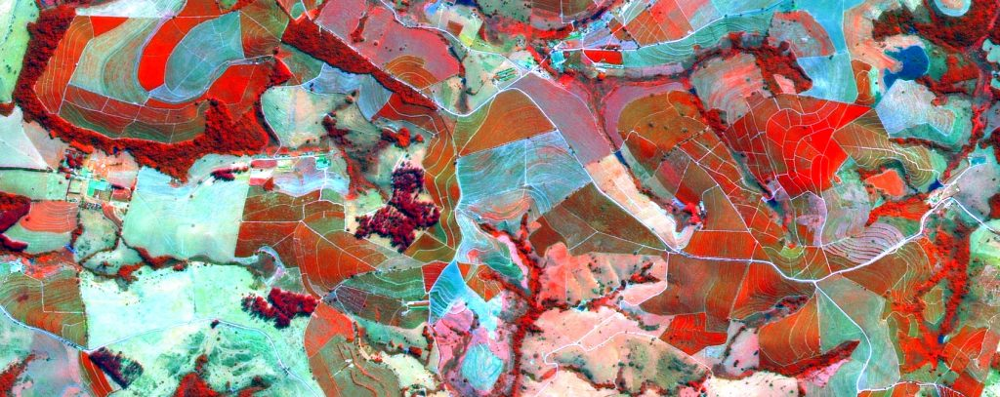</img>

The [Brazilian Coffee Scenes](http://patreo.dcc.ufmg.br/2017/11/12/brazilian-coffee-scenes-dataset/) dataset, proposed in ["Do Deep Features Generalize from Everyday Objects to Remote Sensing and Aerial Scenes Domains?", Penatti et al.](https://ieeexplore.ieee.org/document/7301382) is a scene classification dataset of 2,876 64x64 3-band (Green, Red, NIR) images taken by the [SPOT satellites](https://www.wikiwand.com/en/SPOT_(satellite)) in 2005 over four counties in the State of Minas Gerais, Brazil. This dataset was developed to classify coffee crops from non-coffee crops.

The dataset can be downloaded (0.01GB) using `scripts/download_brazilian_coffee_.sh` and instantiated below:

```python
import torchvision.transforms as T
from torchrs.datasets import BrazilianCoffeeScenes

transform = T.Compose([T.ToTensor()])

dataset = BrazilianCoffeeScenes(
    root="path/to/dataset/",
    transform=transform
)

x, y = dataset[0]
"""
x: (3, 64, 64)
y: int
"""

dataset.classes
"""
['non-coffee', 'coffee']
"""
```

## Models

* [Multi-Image Super Resolution - RAMS](https://github.com/isaaccorley/torchrs#multi-image-super-resolution---rams)
* [Change Detection - FC-EF, FC-Siam-conc, and FC-Siam-diff](https://github.com/isaaccorley/torchrs#change-detection---fully-convolutional-early-fusion-fc-ef-siamese-concatenation-fc-siam-conc-and-siamese-difference-fc-siam-diff)
* [Change Detection - EarlyFusion (EF) and Siamese (Siam)](https://github.com/isaaccorley/torchrs#change-detection---early-fusion-ef-and-siamese-siam)

### Multi-Image Super Resolution - RAMS

</img>

Residual Attention Multi-image Super-resolution Network (RAMS) from 
["Multi-Image Super Resolution of Remotely Sensed Images Using Residual Attention Deep Neural Networks",
Salvetti et al. (2021)](https://www.mdpi.com/2072-4292/12/14/2207)

RAMS is currently one of the top performers on the [PROBA-V Super Resolution Challenge](https://kelvins.esa.int/proba-v-super-resolution/home/). This Multi-image Super Resolution (MISR) architecture utilizes attention based methods to extract spatial and spatiotemporal features from a set of low resolution images to form a single high resolution image. Note that the attention methods are effectively Squeeze-and-Excitation blocks from ["Squeeze-and-Excitation Networks", Hu et al.](https://arxiv.org/abs/1709.01507).

```python
import torch
from torchrs.models import RAMS

# increase resolution by factor of 3 (e.g. 128x128 -> 384x384)
model = RAMS(
    scale_factor=3,
    t=9,
    c=1,
    num_feature_attn_blocks=12
)

# Input should be of shape (bs, t, c, h, w), where t is the number
# of low resolution input images and c is the number of channels/bands
lr = torch.randn(1, 9, 1, 128, 128)
sr = model(lr) # (1, 1, 384, 384)
```

### Change Detection - Fully Convolutional Early Fusion (FC-EF), Siamese Concatenation (FC-Siam-conc), and Siamese Difference (FC-Siam-diff)

</img>

Fully Convolutional Early Fusion (FC-EF), Siamese Concatenation (FC-Siam-conc), Siamese Difference (FC-Siam-conc) and are change detection segmentation architectures proposed in ["Fully Convolutional Siamese Networks for Change Detection", Daudt et al.](https://arxiv.org/abs/1810.08462). The architectures are essentially modified U-Nets from ["U-Net: Convolutional Networks for Biomedical Image Segmentation", Ronneberger et al.](https://arxiv.org/abs/1505.04597). FC-EF is a U-Net which takes as input the concatenated images. FC-Siam-conc and FC-Siam-diff are U-Nets with a shared encoder which concatenate or take the difference of the skip connections, respectively. Both models been modified to work with any number of input images `t` and channels `c`.

```python
import torch
from torchrs.models import FCEF, FCSiamConc, FCSiamDiff

model = FCEF(
    channels=3,
    t=2,
    num_classes=2
)

model = FCSiamConc(
    channels=3,
    t=2,
    num_classes=2
)

model = FCSiamDiff(
    channels=3,
    t=2,
    num_classes=2
)


x = torch.randn(1, 2, 3, 128, 128)  # (b, t, c, h, w)
model(x)                            # (b, num_classes, h, w)
```

### Change Detection - Early Fusion (EF) and Siamese (Siam)

Early Fusion (EF) and Siamese (Siam) are change detection architectures proposed along with the [OSCD - Onera Satellite Change Detection](https://github.com/isaaccorley/torchrs#onera-satellite-change-detection-oscd) dataset in ["Urban Change Detection for Multispectral Earth Observation Using Convolutional Neural Networks", Daudt et al.](https://arxiv.org/abs/1810.08468). The architectures are effectively CNN classifiers which are trained to classify whether the central pixel of a set (typically a pair) of input patches contains change/no change. EF takes as input the concatenated images while Siam extracts feature vectors using a shared CNN and then feeds the concatenated vectors to a MLP classifier. Both models expect patches of size Cx15x15 but have been modified to work with any number of input images `t` and channels `c`.

```python
import torch
from torchrs.models import EarlyFusion, Siam

model = EarlyFusion(
    channels=3,
    t=2,
    num_classes=2
)

model = Siam(
    channels=3,
    t=2,
    num_classes=2
)


x = torch.randn(1, 2, 3, 15, 15)  # (b, t, c, h, w)
model(x)                          # (b, num_classes, h, w)
```

## Training

For training purposes, each model and dataset has been adapted into [Pytorch Lightning](https://www.pytorchlightning.ai/) [LightningModules](https://pytorch-lightning.readthedocs.io/en/stable/common/lightning_module.html) and [LightningDataModules](https://pytorch-lightning.readthedocs.io/en/stable/extensions/datamodules.html), respectively. The modules can be found in `torchrs.train.modules` and `torchrs.train.datamodules`. Among other things, Pytorch Lightning has the benefits of reducing boilerplate code, requiring minimal rewrite for multi-gpu/cluster training, supports mixed precision training, gradient accumulation, callbacks, logging metrics, etc.

To use the training features, torch-rs must be installed with the `train` extras.

```bash
# pypi
pip install 'torch-rs[train]'

# latest
pip install 'git+https://github.com/isaaccorley/torchrs.git#egg=torch-rs[train]'
```

A simple training example:

```python
import torch
import torch.nn as nn
import pytorch_lightning as pl

from torchrs.train.modules import FCEFModule
from torchrs.train.datamodules import LEVIRCDPlusDataModule
from torchrs.transforms import Compose, ToTensor


def collate_fn(batch):
    x = torch.stack([x["x"] for x in batch])
    y = torch.cat([x["mask"] for x in batch])
    x = x.to(torch.float32)
    y = y.to(torch.long)
    return x, y 

transform = Compose([ToTensor()])
model = FCEFModule(channels=3, t=2, num_classes=2, lr=1E-3)
dm = LEVIRCDPlusDataModule(
    root="path/to/dataset",
    transform=transform,
    batch_size=4,
    num_workers=2,
    prefetch_factor=1,
    collate_fn=collate_fn,
    test_collate_fn=collate_fn,
    val_split=0.2
)
callbacks = [
    pl.callbacks.ModelCheckpoint(monitor="val_loss", mode="min", verbose=True, save_top_k=1),
    pl.callbacks.EarlyStopping(monitor="val_loss", mode="min", patience=10)
]
trainer = pl.Trainer(
    gpus=1,
    precision=16,
    accumulate_grad_batches=1,
    max_epochs=25,
    callbacks=callbacks,
    weights_summary="top"
)
trainer.fit(model, datamodule=dm)
trainer.test(datamodule=dm)
```

## Tests

```bash
$ pytest -ra
```
