# PyTorch Remote Sensing (torchrs)

(WIP) PyTorch implementation of popular datasets and models in remote sensing tasks (Change Detection, Image Super Resolution, Land Cover Classification/Segmentation, Image-to-Image Translation, etc.) for various Optical (Sentinel-2, Landsat, etc.) and Synthetic Aperture Radar (SAR) (Sentinel-1) sensors.

## Installation

```bash
# pypi
pip install torch-rs

# pypi with training extras
pip install torch-rs[train]

# latest
pip install git+https://github.com/isaaccorley/torchrs

# latest with training extras
pip install -e git+https://github.com/isaaccorley/torchrs.git#egg=torch-rs[train]
```

## Table of Contents

* [Datasets](https://github.com/isaaccorley/torchrs#datasets)
* [Models](https://github.com/isaaccorley/torchrs#models)
* [Training](https://github.com/isaaccorley/torchrs#training)

## Datasets

* [PROBA-V Multi-Image Super Resolution](https://github.com/isaaccorley/torchrs#proba-v-super-resolution)
* [ETCI 2021 Flood Detection](https://github.com/isaaccorley/torchrs#etci-2021-flood-detection)
* [FAIR1M Fine-grained Object Recognition](https://github.com/isaaccorley/torchrs#fair1m---fine-grained-object-recognition)
* [OSCD - Onera Satellite Change Detection](https://github.com/isaaccorley/torchrs#onera-satellite-change-detection-oscd)
* [S2Looking - Satellite Side-Looking Change Detection](https://github.com/isaaccorley/torchrs#satellite-side-looking-s2looking-change-detection)
* [LEVIR-CD+ - LEVIR Change Detection+](https://github.com/isaaccorley/torchrs#levir-change-detection-levir-cd)
* [RSVQA LR - Remote Sensing Visual Question Answering Low Resolution](https://github.com/isaaccorley/torchrs#remote-sensing-visual-question-answering-rsvqa-low-resolution-lr)
* [RSVQAxBEN - Remote Sensing Visual Question Answering BigEarthNet](https://github.com/isaaccorley/torchrs#remote-sensing-visual-question-answering-bigearthnet-rsvqaxben)
* [RSICD - Remote Sensing Image Captioning Dataset](https://github.com/isaaccorley/torchrs#remote-sensing-image-captioning-dataset-rsicd)
* [RESISC45 - Remote Sensing Image Scene Classification](https://github.com/isaaccorley/torchrs#remote-sensing-image-scene-classification-resisc45)
* [EuroSAT](https://github.com/isaaccorley/torchrs#eurosat)

### PROBA-V Super Resolution

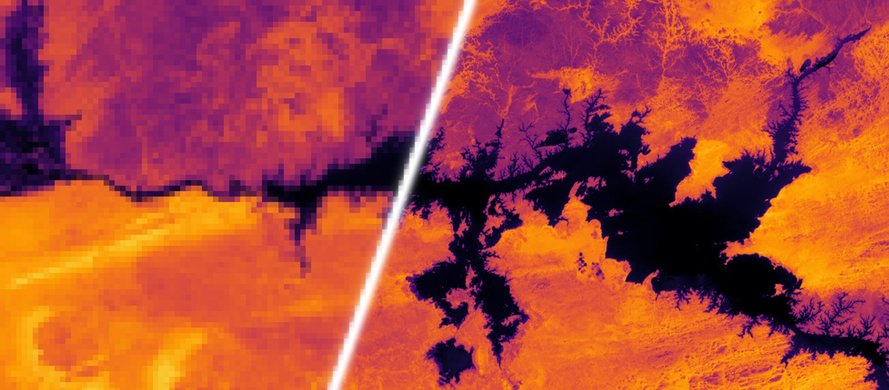</img>

The [PROBA-V Super Resolution Challenge](https://kelvins.esa.int/proba-v-super-resolution/home/) dataset is a Multi-image Super Resolution (MISR) dataset of images taken by the [ESA PROBA-Vegetation satellite](https://earth.esa.int/eogateway/missions/proba-v). The dataset contains sets of unregistered 300m low resolution (LR) images which can be used to generate single 100m high resolution (HR) images for both Near Infrared (NIR) and Red bands. In addition, Quality Masks (QM) for each LR image and Status Masks (SM) for each HR image are available. The PROBA-V contains sensors which take imagery at 100m and 300m spatial resolutions with 5 and 1 day revisit rates, respectively. Generating high resolution imagery estimates would effectively increase the frequency at which HR imagery is available for vegetation monitoring.

The dataset can be downloaded (0.83GB) using `scripts/download_probav.sh` and instantiated below:

```python
from torchrs.transforms import Compose, ToTensor
from torchrs.datasets import PROBAV

transform = Compose([ToTensor()])

dataset = PROBAV(
    root="path/to/dataset/",
    split="train",  # or 'test'
    band="RED",     # or 'NIR'
    lr_transform=transform,
    hr_transform=transform
)

x = dataset[0]
"""
x: dict(
    lr: low res images  (t, 1, 128, 128)
    qm: quality masks   (t, 1, 128, 128)
    hr: high res image  (1, 384, 384)
    sm: status mask     (1, 384, 384)
)
t varies by set of images (minimum of 9)
"""
```

### ETCI 2021 Flood Detection

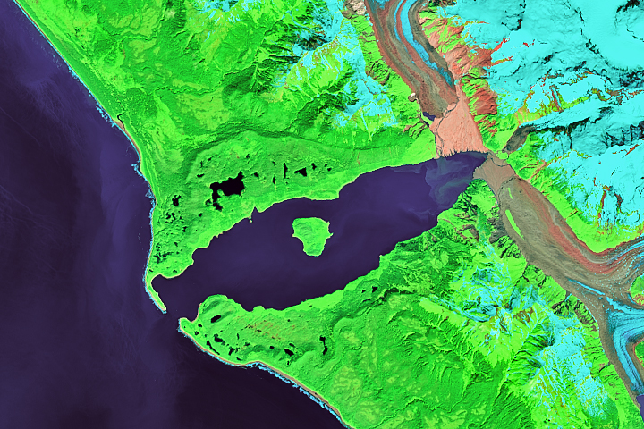</img>

The [ETCI 2021 Dataset](https://nasa-impact.github.io/etci2021/) is a Flood Detection segmentation dataset of SAR images taken by the [ESA Sentinel-1 satellite](https://sentinel.esa.int/web/sentinel/missions/sentinel-1). The dataset contains pairs of VV and VH polarization images processed by the Hybrid Pluggable Processing Pipeline (hyp3) along with corresponding binary flood and water body ground truth masks.

The dataset can be downloaded (5.6GB) using `scripts/download_etci2021.sh` and instantiated below:

```python
from torchrs.transforms import Compose, ToTensor
from torchrs.datasets import ETCI2021

transform = Compose([ToTensor()])

dataset = ETCI2021(
    root="path/to/dataset/",
    split="train",  # or 'val', 'test'
    transform=transform
)

x = dataset[0]
"""
x: dict(
    vv:         (3, 256, 256)
    vh:         (3, 256, 256)
    flood_mask: (1, 256, 256)
    water_mask: (1, 256, 256)
)
"""
```

### FAIR1M - Fine-grained Object Recognition

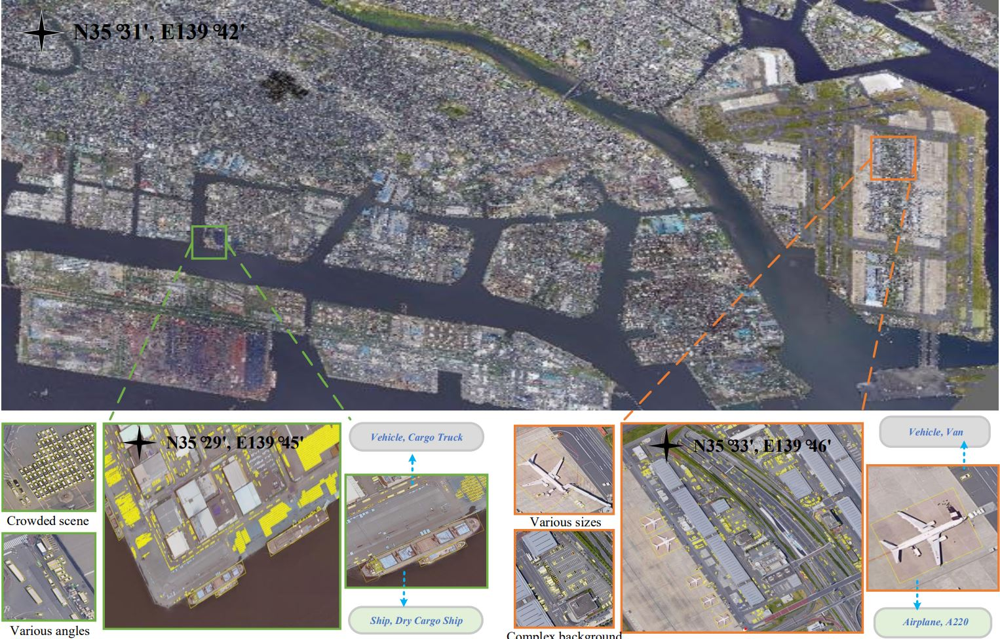</img>

The [FAIR1M](https://rcdaudt.github.io/oscd/) dataset, proposed in ["FAIR1M: A Benchmark Dataset for Fine-grained Object Recognition in High-Resolution Remote Sensing Imagery", Sun et al.](https://arxiv.org/abs/2103.05569) is a Fine-grained Object Recognition/Detection dataset of 15,000 high resolution (0.3-0.8m) RGB images taken by the [Gaogen (GF)](https://earth.esa.int/web/eoportal/satellite-missions/g/gaofen-1) satellites and extracted from [Google Earth](https://earth.google.com/web/). The dataset contains rotated bounding boxes for objects of 5 (ships, vehicles, airplanes, courts, and roads) categories and 37 sub-categories. This dataset is a part of the [ISPRS Benchmark on Object Detection in High-Resolution Satellite Images](http://gaofen-challenge.com/benchmark). Note that only a portion of dataset has been released so far for the challenge (1,732/15,000 images).

The dataset can be downloaded (8.7GB) using `scripts/download_fair1m.sh` and instantiated below:

```python
import torchvision.transforms as T
from torchrs.datasets import FAIR1M

transform = T.Compose([T.ToTensor()])

dataset = FAIR1M(
    root="path/to/dataset/",
    split="train",  # only 'train' for now
    transform=transform,
)

x = dataset[0]
"""
x: dict(
    x: (3, h, w)
    y: (N,)
    points: (N, 5, 2)
)
where N is the number of objects in the image
"""
```

### Onera Satellite Change Detection (OSCD)

</img>

The [Onera Satellite Change Detection (OSCD)](https://rcdaudt.github.io/oscd/) dataset, proposed in ["Urban Change Detection for Multispectral Earth Observation Using Convolutional Neural Networks", Daudt et al.](https://arxiv.org/abs/1810.08468) is a Change Detection dataset of 13 band multispectral (MS) images taken by the [ESA Sentinel-2 satellite](https://sentinel.esa.int/web/sentinel/missions/sentinel-2). The dataset contains 24 registered image pairs from multiple continents between 2015-2018 along with binary change masks.

The dataset can be downloaded (0.73GB) using `scripts/download_oscd.sh` and instantiated below:

```python
from torchrs.transforms import Compose, ToTensor
from torchrs.datasets import OSCD

transform = Compose([ToTensor(permute_dims=False)])

dataset = OSCD(
    root="path/to/dataset/",
    split="train",  # or 'test'
    transform=transform,
)

x = dataset[0]
"""
x: dict(
    x: (2, 13, h, w)
    mask: (1, h, w)
)
"""
```

### Satellite Side-Looking (S2Looking) Change Detection

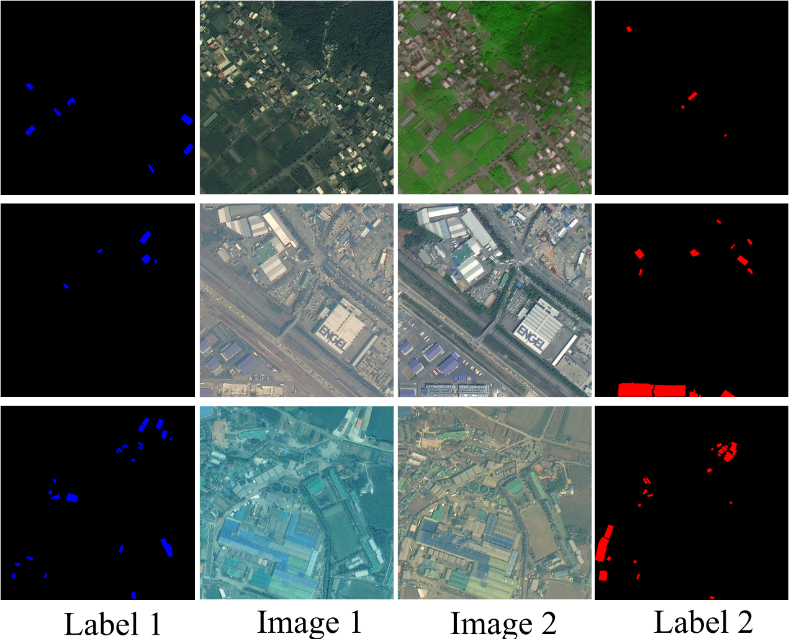</img>

The [S2Looking](https://github.com/AnonymousForACMMM/Dataset) dataset, proposed in ["S2Looking: A Satellite Side-Looking Dataset for Building Change Detection", Shen et al.](https://arxiv.org/abs/2107.09244) is a rural building Change Detection dataset of 5,000 very high resolution (VHR) 0.5-0.8m registered RGB image pairs of varying off-nadir angles taken by the [Gaogen (GF)](https://earth.esa.int/web/eoportal/satellite-missions/g/gaofen-1), [SuperView (SV)](https://eos.com/find-satellite/superview-1/), and [BeiJing-2 (BJ-2)](https://space.oscar.wmo.int/satelliteprogrammes/view/beijing_2) satellites. The dataset contains separate new and demolished building masks from regions all over the Earth a time span of 1-3 years. This dataset was proposed along with the LEVIR-CD+ dataset and is considered difficult due to the rural locations and off-nadir angles.

The dataset can be downloaded (11GB) using `scripts/download_s2looking.sh` and instantiated below:

```python
from torchrs.transforms import Compose, ToTensor
from torchrs.datasets import S2Looking

transform = Compose([ToTensor()])

dataset = S2Looking(
    root="path/to/dataset/",
    split="train",  # or 'val', 'test'
    transform=transform,
)

x = dataset[0]
"""
x: dict(
    x: (2, 3, 1024, 1024)
    build_mask: (1, 1024, 1024),
    demolish_mask: (1, 1024, 1024)
)
"""
```

### LEVIR Change Detection+ (LEVIR-CD+)

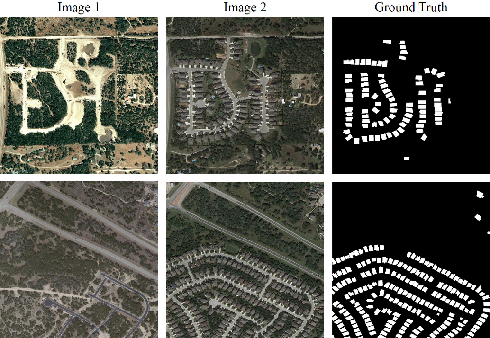</img>

The [LEVIR-CD+](https://github.com/AnonymousForACMMM/Dataset) dataset, proposed in ["S2Looking: A Satellite Side-Looking Dataset for Building Change Detection", Shen et al.](https://arxiv.org/abs/2107.09244) is an urban building Change Detection dataset of 985 very high resolution (VHR) 0.5m RGB image pairs extracted from Google Earth. The dataset contains building/land use change masks from 20 different regions of Texas between 2002-2020 with a time span of 5 years. This dataset was proposed along with the S2Looking dataset and is considered the easier version due to the urban locations and near-nadir angles.

The dataset can be downloaded (3.6GB) using `scripts/download_levircd_plus.sh` and instantiated below:

```python
from torchrs.transforms import Compose, ToTensor
from torchrs.datasets import LEVIRCDPlus

transform = Compose([ToTensor()])

dataset = LEVIRCDPlus(
    root="path/to/dataset/",
    split="train",  # or 'test'
    transform=transform,
)

x = dataset[0]
"""
x: dict(
    x: (2, 3, 1024, 1024)
    mask: (1, 1024, 1024)
)
"""
```

### Remote Sensing Visual Question Answering (RSVQA) Low Resolution (LR)

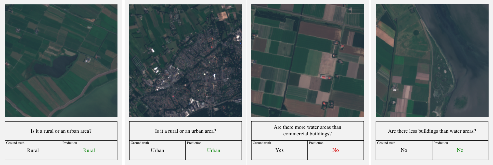</img>

The [RSVQA LR](https://rsvqa.sylvainlobry.com/) dataset, proposed in ["RSVQA: Visual Question Answering for Remote Sensing Data", Lobry et al.](https://arxiv.org/abs/2003.07333) is a visual question answering (VQA) dataset of RGB images taken by the [ESA Sentinel-2 satellite](https://sentinel.esa.int/web/sentinel/missions/sentinel-2). Each image is annotated with a set of questions and their corresponding answers. Among other applications, this dataset can be used to train VQA models to perform scene understanding of medium resolution remote sensing imagery.

The dataset can be downloaded (0.2GB) using `scripts/download_rsvqa_lr.sh` and instantiated below:

```python
import torchvision.transforms as T
from torchrs.datasets import RSVQALR

transform = T.Compose([T.ToTensor()])

dataset = RSVQALR(
    root="path/to/dataset/",
    split="train",  # or 'val', 'test'
    transform=transform
)

x = dataset[0]
"""
x: dict(
    x:         (3, 256, 256)
    questions:  List[str]
    answers:    List[str]
    types:      List[str]
)
"""
```

### Remote Sensing Visual Question Answering BigEarthNet (RSVQAxBEN)

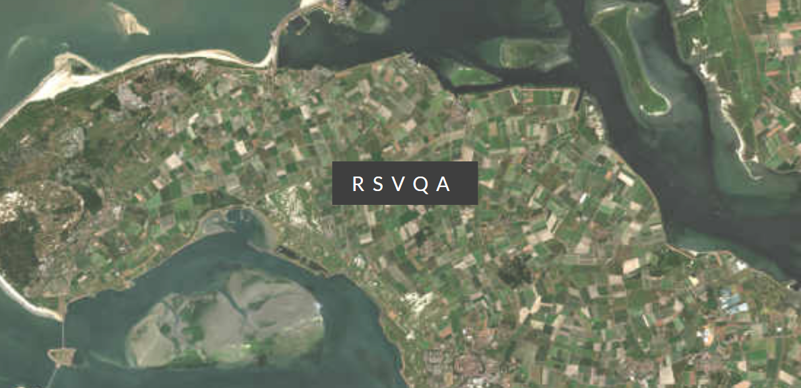</img>

The [RSVQAxBEN](https://rsvqa.sylvainlobry.com/) dataset, proposed in ["RSVQA Meets BigEarthNet: A New, Large-Scale, Visual Question Answering Dataset for Remote Sensing", Lobry et al.](https://rsvqa.sylvainlobry.com/IGARSS21.pdf) is a visual question answering (VQA) dataset for the [BigEarthNet](http://bigearth.net/) dataset using the same method applied to the [RSVQA LR](https://github.com/isaaccorley/torchrs#remote-sensing-visual-question-answering-rsvqa-low-resolution-lr) to generate VQA annotations. The dataset consists of RGB Sentinel-2 imagery annotated with a set of questions and their corresponding answers.

The dataset can be downloaded (35.4GB) using `scripts/download_rsvqaxben.sh` and instantiated below:

```python
import torchvision.transforms as T
from torchrs.datasets import RSVQAxBEN

transform = T.Compose([T.ToTensor()])

dataset = RSVQAxBEN(
    root="path/to/dataset/",
    split="train",  # or 'val', 'test'
    transform=transform
)

x = dataset[0]
"""
x: dict(
    x:         (3, h, w)
    questions:  List[str]
    answers:    List[str]
    types:      List[str]
)
"""
```

### Remote Sensing Image Captioning Dataset (RSICD)

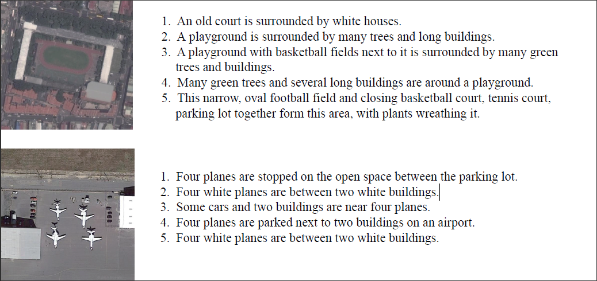</img>

The [RSICD](https://github.com/201528014227051/RSICD_optimal) dataset, proposed in ["Exploring Models and Data for Remote Sensing Image Caption Generation", Lu et al.](https://arxiv.org/abs/1712.07835) is an image captioning dataset with 5 captions per image for 10,921 RGB images extracted using [Google Earth](https://earth.google.com/web/), [Baidu Map](https://map.baidu.com/), [MapABC](https://www.mapabc.com/) and [Tianditu](https://www.tianditu.gov.cn/). While one of the larger remote sensing image captioning datasets, this dataset contains very repetitive language with little detail and many captions are duplicated.

The dataset can be downloaded (0.57GB) using `scripts/download_rsicd.sh` and instantiated below:

```python
import torchvision.transforms as T
from torchrs.datasets import RSICD

transform = T.Compose([T.ToTensor()])

dataset = RSICD(
    root="path/to/dataset/",
    split="train",  # or 'val', 'test'
    transform=transform
)

x = dataset[0]
"""
x: dict(
    x:        (3, 224, 224)
    captions: List[str]
)
"""
```

### Remote Sensing Image Scene Classification (RESISC45)

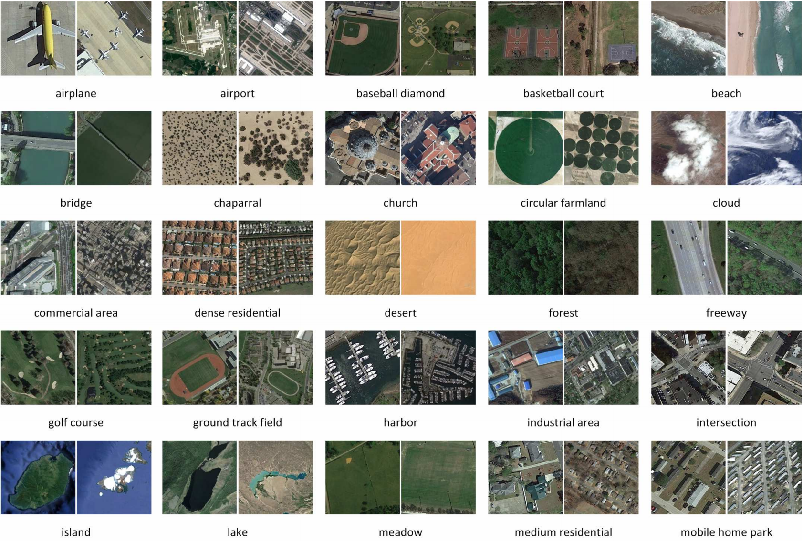</img>

The [RESISC45](http://www.escience.cn/people/JunweiHan/NWPU-RESISC45.html) dataset, proposed in ["Remote Sensing Image Scene Classification: Benchmark and State of the Art", Cheng et al.](https://arxiv.org/abs/1703.00121) is an image classification dataset of 31,500 RGB images extracted using [Google Earth Engine](https://earthengine.google.com/). The dataset contains 45 scenes with 700 images per class from over 100 countries and was selected to optimize for high variability in image conditions (spatial resolution, occlusion, weather, illumination, etc.).

The dataset can be downloaded (0.47GB) using `scripts/download_resisc45.sh` and instantiated below:

```python
import torchvision.transforms as T
from torchrs.datasets import RESISC45

transform = T.Compose([T.ToTensor()])

dataset = RESISC45(
    root="path/to/dataset/",
    transform=transform
)

x, y = dataset[0]
"""
x: (3, 256, 256)
y: int
"""

dataset.classes
"""
['airplane', 'airport', 'baseball_diamond', 'basketball_court', 'beach', 'bridge', 'chaparral',
'church', 'circular_farmland', 'cloud', 'commercial_area', 'dense_residential', 'desert', 'forest',
'freeway', 'golf_course', 'ground_track_field', 'harbor', 'industrial_area', 'intersection', 'island',
'lake', 'meadow', 'medium_residential', 'mobile_home_park', 'mountain', 'overpass', 'palace', 'parking_lot',
'railway', 'railway_station', 'rectangular_farmland', 'river', 'roundabout', 'runway', 'sea_ice', 'ship',
'snowberg', 'sparse_residential', 'stadium', 'storage_tank', 'tennis_court', 'terrace', 'thermal_power_station', 'wetland']
"""
```

### EuroSAT

</img>

The [EuroSAT](https://github.com/phelber/eurosat) dataset, proposed in ["EuroSAT: A Novel Dataset and Deep Learning Benchmark for Land Use and Land Cover Classification", Helber et al.](https://arxiv.org/abs/1709.00029) is a land cover classification dataset of 27,000 images taken by the [ESA Sentinel-2 satellite](https://sentinel.esa.int/web/sentinel/missions/sentinel-2). The dataset contains 10 land cover classes with 2-3k images per class from over 34 European countries. The dataset is available in the form of RGB only or all [Multispectral (MS) Sentinel-2 bands](https://sentinels.copernicus.eu/web/sentinel/user-guides/sentinel-2-msi/resolutions/spatial). This dataset is fairly easy with ~98.6% accuracy achieved with a ResNet-50.

The dataset can be downloaded (.13GB and 2.8GB) using `scripts/download_eurosat_rgb.sh` or `scripts/download_eurosat_ms.sh` and instantiated below:

```python
import torchvision.transforms as T
from torchrs.transforms import ToTensor
from torchrs.datasets import EuroSATRGB, EuroSATMS

transform = T.Compose([T.ToTensor()])

dataset = EuroSATRGB(
    root="path/to/dataset/",
    transform=transform
)

x, y = dataset[0]
"""
x: (3, 64, 64)
y: int
"""

transform = T.Compose([ToTensor()])

dataset = EuroSATMS(
    root="path/to/dataset/",
    transform=transform
)

x, y = dataset[0]
"""
x: (13, 64, 64)
y: int
"""

dataset.classes
"""
['AnnualCrop', 'Forest', 'HerbaceousVegetation', 'Highway', 'Industrial',
'Pasture', 'PermanentCrop', 'Residential', 'River', 'SeaLake']
"""
```

## Models

* [Multi-Image Super Resolution - RAMS](https://github.com/isaaccorley/torchrs#multi-image-super-resolution---rams)
* [Change Detection - FC-EF, FC-Siam-conc, and FC-Siam-diff](https://github.com/isaaccorley/torchrs#change-detection---fully-convolutional-early-fusion-fc-ef-siamese-concatenation-fc-siam-conc-and-siamese-difference-fc-siam-diff)
* [Change Detection - EarlyFusion (EF) and Siamese (Siam)](https://github.com/isaaccorley/torchrs#change-detection---early-fusion-ef-and-siamese-siam)

### Multi-Image Super Resolution - RAMS

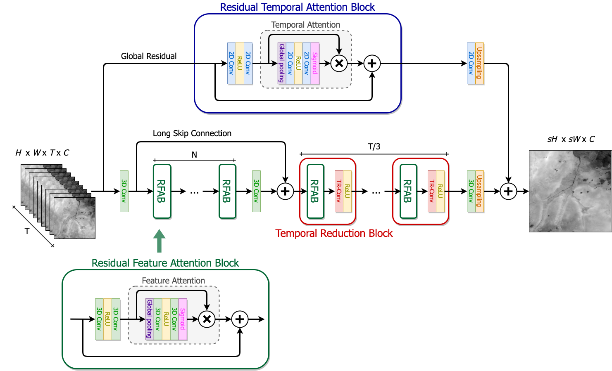</img>

Residual Attention Multi-image Super-resolution Network (RAMS) from 
["Multi-Image Super Resolution of Remotely Sensed Images Using Residual Attention Deep Neural Networks",
Salvetti et al. (2021)](https://www.mdpi.com/2072-4292/12/14/2207)

RAMS is currently one of the top performers on the [PROBA-V Super Resolution Challenge](https://kelvins.esa.int/proba-v-super-resolution/home/). This Multi-image Super Resolution (MISR) architecture utilizes attention based methods to extract spatial and spatiotemporal features from a set of low resolution images to form a single high resolution image. Note that the attention methods are effectively Squeeze-and-Excitation blocks from ["Squeeze-and-Excitation Networks", Hu et al.](https://arxiv.org/abs/1709.01507).

```python
import torch
from torchrs.models import RAMS

# increase resolution by factor of 3 (e.g. 128x128 -> 384x384)
model = RAMS(
    scale_factor=3,
    t=9,
    c=1,
    num_feature_attn_blocks=12
)

# Input should be of shape (bs, t, c, h, w), where t is the number
# of low resolution input images and c is the number of channels/bands
lr = torch.randn(1, 9, 1, 128, 128)
sr = model(lr) # (1, 1, 384, 384)
```

### Change Detection - Fully Convolutional Early Fusion (FC-EF), Siamese Concatenation (FC-Siam-conc), and Siamese Difference (FC-Siam-diff)

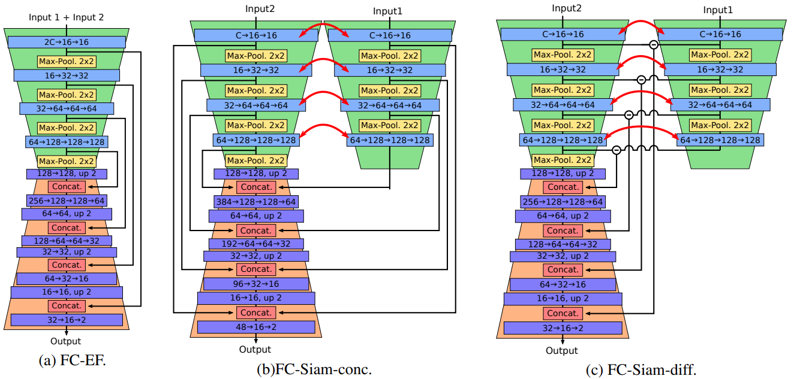</img>

Fully Convolutional Early Fusion (FC-EF), Siamese Concatenation (FC-Siam-conc), Siamese Difference (FC-Siam-conc) and are change detection architectures proposed in ["Fully Convolutional Siamese Networks for Change Detection", Daudt et al.](https://arxiv.org/abs/1810.08462). The architectures are essentially modified U-Nets from ["U-Net: Convolutional Networks for Biomedical Image Segmentation", Ronneberger et al.](https://arxiv.org/abs/1505.04597) that are trained to perform change detection segmentation between a set (typically a pair) of images. FC-EF is a U-Net which takes as input the concatenated images. FC-Siam-conc and FC-Siam-diff are U-Nets with a shared encoder for all input images with the exception of FC-Siam-conc concatenating the skip connections and FC-Siam-diff taking the difference of skip connections. Both models been modified to work with any number of input images `t` and channels `c`.

```python
import torch
from torchrs.models import FCEF, FCSiamConc, FCSiamDiff

model = FCEF(
    channels=3,
    t=2,
    num_classes=2
)

model = FCSiamConc(
    channels=3,
    t=2,
    num_classes=2
)

model = FCSiamDiff(
    channels=3,
    t=2,
    num_classes=2
)


x = torch.randn(1, 2, 3, 128, 128)  # (b, t, c, h, w)
model(x)                            # (b, num_classes, h, w)
```

### Change Detection - Early Fusion (EF) and Siamese (Siam)

Early Fusion (EF) and Siamese (Siam) are patch-based change detection architectures proposed along with the [OSCD - Onera Satellite Change Detection](https://github.com/isaaccorley/torchrs#onera-satellite-change-detection-oscd) dataset in ["Urban Change Detection for Multispectral Earth Observation Using Convolutional Neural Networks", Daudt et al.](https://arxiv.org/abs/1810.08468). The architectures are effectively CNN classifiers which are trained to classify whether the central pixel of a set (typically a pair) of input patches contains change/no change. EF takes as input the concatenated images while Siam is a extracts features vectors using a shared CNN and then feeds the concatenated vectors to a MLP classifier. Both models expect patches of size Cx15x15 but have been modified to work with any number of input images `t` and channels `c`.

```python
import torch
from torchrs.models import EarlyFusion, Siam

model = EarlyFusion(
    channels=3,
    t=2,
    num_classes=2
)

model = Siam(
    channels=3,
    t=2,
    num_classes=2
)


x = torch.randn(1, 2, 3, 15, 15)  # (b, t, c, h, w)
model(x)                          # (b, num_classes, h, w)
```

## Training

For training purposes, each model and dataset has been adapted into [Pytorch Lightning](https://www.pytorchlightning.ai/) [LightningModules](https://pytorch-lightning.readthedocs.io/en/stable/common/lightning_module.html) and [LightningDataModules](https://pytorch-lightning.readthedocs.io/en/stable/extensions/datamodules.html), respectively. The modules can be found in `torchrs.train.modules` and `torchrs.train.datamodules`. Among other things, Pytorch Lightning has the benefits of reducing boilerplate code, requiring minimal rewrite for multi-gpu/cluster training, supports mixed precision training, gradient accumulation, callbacks, logging metrics, etc.

To use the training features the `train` extras must be installed:

```bash
# pypi
pip install torch-rs[train]

# latest
pip install -e git+https://github.com/isaaccorley/torchrs.git#egg=torch-rs[train]
```

A simple training example:

```python
import torch
import torch.nn as nn
import pytorch_lightning as pl
import torchvision.transforms as T
from torchrs.train.modules import RAMSModule
from torchrs.train.datamodules import PROBAVDataModule
from torchrs.transforms import ToTensor


model = RAMSModule(
    scale_factor=3,
    t=9,
    c=1,
    loss=nn.MSELoss(),
    opt=torch.optim.Adam,
    lr=3E-4
)
dm = PROBAVDataModule(
    root="path/to/dataset",
    band="RED",
    lr_transform=T.Compose([ToTensor()]),
    hr_transform=T.Compose([ToTensor()]),
    batch_size=16,
    num_workers=0,
    prefetch_factor=2,
    pin_memory=True
)
callbacks = [
    pl.callbacks.ModelCheckpoint(monitor="train_loss", mode="min", verbose=True, save_top_k=1),
    pl.callbacks.EarlyStopping(monitor="train_loss", mode="min", patience=5)
]
trainer = pl.Trainer(
    gpus=1,
    precision=16,
    max_epochs=25,
    callbacks=callbacks,
    weights_summary="top"
)
trainer.fit(model, datamodule=dm)
trainer.test(datamodule=dm)

```

## Tests

```bash
$ pytest -ra
```
